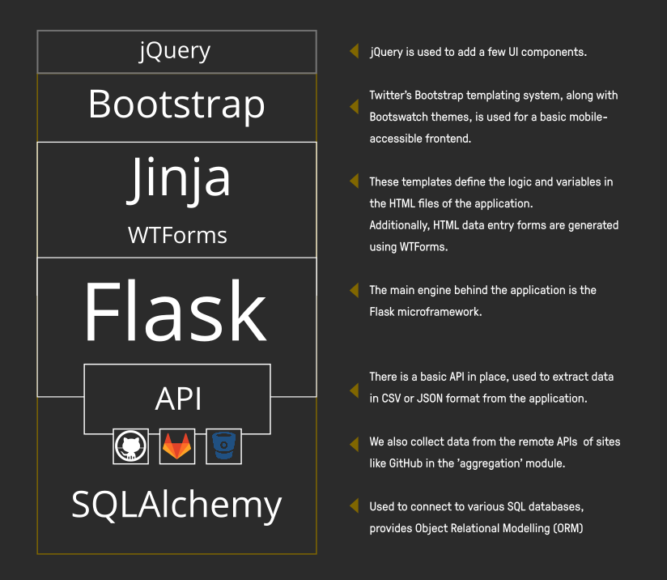

Developer Guide

---

This document contains additional information on contributing to dribdat as a developer.
If you are interested in connecting to dribdat's API, scroll down to the [API overview](#api-guide)
For more background references, see the [README](https://github.com/dribdat/dribdat#dribdat).

# Welcome, contributor!

Thanks for checking out `dribdat` - a tool made for brilliant, openly contributing people like you!
This code is originally based on [cookiecutter-flask](https://github.com/cookiecutter-flask/cookiecutter-flask),
which has a number of helpful [developer features](https://github.com/cookiecutter-flask/cookiecutter-flask#features).

Dribdat is a Python 3 project that uses the Flask microframework and SQLAlchemy for data modelling on the backend.
A plain JSON API, along with Jinja templates and WTForms, serves data to a frontend based on Bootstrap 3 and jQuery.



## Getting started

It is possible to start a development build using the `docker-compose.local.yml` configuration for Docker Compose. Otherwise, you need to set up your coding environment as follows.

(1) Install [Git](https://git-scm.com/), [Python](https://python.org) and [Poetry](https://python-poetry.org/) to start working with the code. Virtualenv and `pip` are also supported as alternatives to Poetry. Then get the sources using `git`:

```
git clone https://codeberg.org/dribdat/dribdat.git
cd dribdat
```

(2) You may need to install additional system libraries (`libffi`) for the [misaka](http://misaka.61924.nl/) package, which depends on [CFFI](https://cffi.readthedocs.io/en/latest/installation.html#platform-specific-instructions). You are likely to also need development headers for Python.

- For example, in Fedora Linux run: `sudo dnf install libffi-devel python3-devel gcc`
- On Ubuntu (`apt`) or Alpine Linux (`apk`): `sudo apk add libffi-dev python3-dev gcc`

(3) Next, run the following commands from the repository root folder to bootstrap your environment with Poetry:

```
poetry install
poetry shell
```

(If using plain pip: `pip install -r requirements/dev.txt`)

(4) By default in a dev environment, a SQLite database will be created in the root folder (`dev.db`). You can also install and configure your choice of DBMS [supported by SQLAlchemy](http://docs.sqlalchemy.org/en/rel_1_1/dialects/index.html). In production, the `DATABASE_URL` configures connectivity to an SQLAlchemy-compatible database engine. This requires a `DRIBDAT_ENV=prod` configuration.

> **Tip**: Use `.flaskenv` or `.env` to store environment variables for local development. See the [Configuration](#configuration) section for more details.

(5) Run the following to create your local SQLite database tables and perform the initial migration. Note that we avoid using the production `migrations` folder locally due to [Flask-Migrate#61](https://github.com/miguelgrinberg/Flask-Migrate/issues/61):

```
mv migrations migrations_prod
python manage.py db init
python manage.py db migrate
python manage.py db upgrade
```

(6) Install a local copy of frontend resources for offline development using [npm](https://nodejs.org/) or [yarn](https://yarnpkg.com/en/docs/getting-started). These will be used when `FLASK_ENV=dev`, otherwise a CDN will be used in production. I.e.:

`npm install`

(7) Finally, run this command (or just `debug.sh`) to start the server:

```
FLASK_DEBUG=1 python manage.py run
```

You should at this point see a welcome screen at http://127.0.0.1:5000 🎉

Follow the instructions to register your first user account, which will have admin access, and let you set up events.

## Data schema

One starts an **Event**, to which Challenges (= Ideas) are added. These can take the form of **Projects** (at progress level 0), or **Categories**. A team is made of up of any number of **Users** who have certain organizer-defined **Roles** and have joined a **Project**.

The main models are represented here:

[](https://mermaid-js.github.io/mermaid-live-editor/#/edit/eyJjb2RlIjoiZ3JhcGggVERcbiAgICBFdmVudCAtLS0gUHJvamVjdFxuICAgIFByb2plY3QgLS0tIFVzZXJcbiAgICBQcm9qZWN0IC0tLSBDYXRlZ29yeVxuICAgIFByb2plY3QgLS0tIFByb2dyZXNzXG4gICAgQWN0aXZpdGllcyAtLS0gVXNlciAmIFByb2plY3QgJiBSZXNvdXJjZVxuICAgIFVzZXIgLS0tIFJvbGUiLCJtZXJtYWlkIjp7InRoZW1lIjoiZGVmYXVsdCJ9LCJ1cGRhdGVFZGl0b3IiOmZhbHNlfQ)

What are the differences between a Project and a Challenge?

- A **Challenge** is a problem statement, often with some elaboration of some ideas of how to address it - at a hackathon, this typically involves links to technical tools, datasets, or information resources. In dribdat, these are published in the form of Projects (set to an initial idea/challenge stage) and/or **Categories**.
- A **Project** contains evidence of work that has been done - typically but not always in response to a specific Challenge, as often as possible with links to documentation, source code, presentation, or any other relevant artifacts.

## Coding tips

This section has some advice for developers and operators.

### Shell access

To open the interactive shell, run: `python manage.py shell`. By default, you will have access to the `User` model, as well as Event, Project, Category, Activity.

Using the [Heroku toolchain](https://devcenter.heroku.com/categories/command-line), `heroku run python manage.py shell`, or using [Docker](https://www.docker.com/), `docker-compose run --rm dribdat python manage.py shell`.

### Running Tests

To run all tests, whose source is in the **tests** folder, run: `python manage.py test`

To run just a specific test, specify it by name, e.g. `python manage.py test --name features`

### Migrations

Whenever a database migration needs to be made. Run the following commands:

```
python manage.py db migrate
```

This will generate a new migration script. Then run:

```
python manage.py db upgrade
```

To apply the migration. Watch out for any errors in the process.

For a full migration command reference, run `python manage.py db --help`.


## API Guide

There are a number of API calls that admins can use to easily get to the data in Dribdat in various formats. The full list of calls is shown in the **About** or Search page in a running app.

Look up data on the current event with the [Hackathon Schema.org Type](https://schema.org/Hackathon):

- `/hackathon.json`

Or like this for another sprint, which is how we call our events:

- `/api/event/<EVENT ID>/hackathon.json`

For basic information and projects in the current sprint:

- `/api/event/current/info.json`
- `/api/event/<EVENT ID>/info.json`
- `/api/event/current/projects.json` (or `.csv`)
- `/api/event/<EVENT ID>/projects.json` (or `.csv`)
- `/api/event/current/activity.json` (or `.csv`)
- `/api/event/<EVENT ID>/activity.json` (or `.csv`)

Details on a project:

- `/api/project/<PROJECT ID>/info.json`
- `/api/project/<PROJECT ID>/activity.json`

To get the full list of events, or all the latest activities:

- `/api/events.json` (or `.csv`)
- `/api/project/activity.json` (or `.csv`)

To get your logged in user's full data:

- `/api/user/current/my-hackathons.json`

To get just public data for any user:

- `/api/user/<USER NAME>`

To search through all project contents:

- `/api/project/search.json?q=<text_query>`

Use the `limit` query parameter to get more or less than 10 results.

### Write access (beta)

If you would like to use external clients, like the chatbot, to remote control Dribdat you need to set `DRIBDAT_APIKEY`. The (experimental) call used to push data into projects is:

- `/api/project/push.json`

### Technical details

For more details see [api.py](https://github.com/dribdat/dribdat/blob/main/dribdat/public/api.py)
