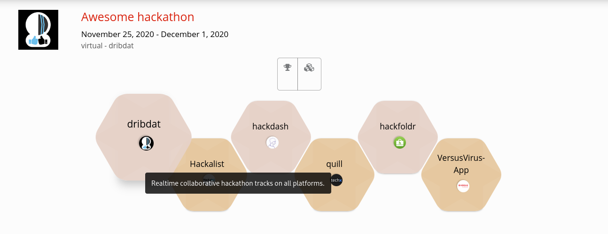

**Driven by Data**

---

Here you can find documentation about the `dribdat` open source project. Please see our [Launch page](https://dribd.at), [Open Collective](https://opencollective.com/dribdat) and [Code repo](https://github.com/dribdat/dribdat#dribdat) for a general introduction, downloads and more!

1. [About dribdat](about)
1. [User handbook](usage)
1. [Installation guide](deploy)
1. [How to contribute](contribute)
1. [Whitepaper](whitepaper)
1. [Troubleshooting help](trouble)

# Intro

**dribdat** (originally from "Driven By Data") is an open source (MIT licensed) web application, featuring an ideation and challenge board to help organize short sprints, co-creative sessions, hackdays and **open hackathons with batteries included**. 

Built around Web-friendly standards like [Schema.org](https://schema.org) and [Frictionless Data](https://frictionlessdata.io), dribdat features a collection of bootstraps (authentication, file uploading, data import/export, etc.), useful workflows (announce an event - publish challenges - form teams - develop projects) and channels (social media sharing, digital signage, summary reports). 

We use it to run activities based on open licenses ([Creative Commons](https://creativecommons.org/licenses/), [Open Data Commons](https://opendatacommons.org/licenses/odbl/), etc.), community-developed templates ([School of Data Pipeline](https://schoolofdata.org/methodology/)), and governance instruments ([Hack Code of Conduct](https://hackcodeofconduct.org/)). It is the official platform of [Opendata.ch - Swiss chapter of Open Knowledge](https://opendata.ch), and has been used to host dozens of events in the Swiss [open data](https://hack.opendata.ch), [open hardware](https://now.makezurich.ch), and [open source](https://hacknight.dinacon.ch) community.

Dribdat strives in itself to be an example of a hackable project that can be adapted to other needs and causes. It can be used just as a Python-powered backend to aggregate data from GitHub, GitLab and other repositories and fileshares in one place. There is a [Vue.js app](https://github.com/dribdat/backboard) and a [Node.js chatbot](https://github.com/dribdat/dridbot) available as alternatives to the default Bootstrap user interface, easily customized with a bit of CSS. You can customize the layout and presets in an admin panel, or with YAML configuration files.

## Get in touch

Via our [contact form](https://dribd.at/#contact) or [raise an issue](https://github.com/dribdat/dribdat/issues). If you would like to improve the documentation, please share [feedback here](https://github.com/dribdat/docs/issues), or contribute via Pull Request.

Get updates on our [OpenCollective](https://opencollective.com/dribdat/updates), where you can also support the development of the project. There you can find a range of excellent events that have been powered by dribdat on the Web. Please don't hesitate to get in touch if you'd like to get help accelerating your community!

🌳 😄 🏀 
