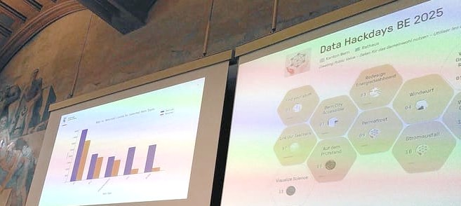

# Driven By Data

<h3>The open platform for data-driven hackathons and hexagonal teams</h3>

[🏀 Demo](https://demo.dribdat.cc/event/1)
[📁 Docker](https://hub.docker.com/r/dribdat/dribdat/tags)
[👍 Deploy](deploy)

**Dribdat** is an open source ideation and challenge board, that helps you to run code sprints, creative jams, playful hackdays and [awesome hackathons](https://awesome.dribdat.cc/)
 ⬡⬢⬡ 

 <a href="https://alternativeto.net/software/dribdat/" target="_blank">♥️ Heart on AlternativeTo</a>
 <a href="https://codeberg.org/dribdat/dribdat" target="_blank">⭐ Favorite on Codeberg</a>
 <a href="https://github.com/dribdat/dribdat" target="_blank">⭐ Star this on GitHub</a>

Please use our [discussion forum](https://github.com/orgs/dribdat/discussions) or [raise an issue](https://github.com/dribdat/dribdat/issues). If you would like to improve the documentation, share [feedback here](https://github.com/dribdat/docs/issues), or contribute via Pull Request on GitHub. You can also use our [Codeberg mirrors](https://codeberg.org/dribdat) to do this.

We aim to include people of all backgrounds in using + developing this tool - no matter your age, gender, race, ability, or sexual identity. Please review our [Code of Conduct](CODE_OF_CONDUCT.md) 🏳️‍🌈 

Further contact options:

- **Get in touch with [the maintainers](mailto:dribdat@datalets.ch) if you'd like to get help accelerating your community!** 📨
- Subscribe to get updates on our [OpenCollective](https://opencollective.com/dribdat/updates), where you can support our development 🩵
- Find a sampling of Dribdat-powered events at [Tour de Hack](tour) 🏀
- Edit this Livemark-powered [documentation site](https://codeberg.org/dribdat/docs) or other projects ✏️
- Read more about the project in the [User Guide](usage), [Purpose](purpose) and [Whitepaper](whitepaper) 📑
- See our [roadmap](https://github.com/orgs/dribdat/projects/8/views/2?pane=issue&itemId=89596986) and sign up for beta releases at [EveryHack.day](https://everyhack.day) 🔜
