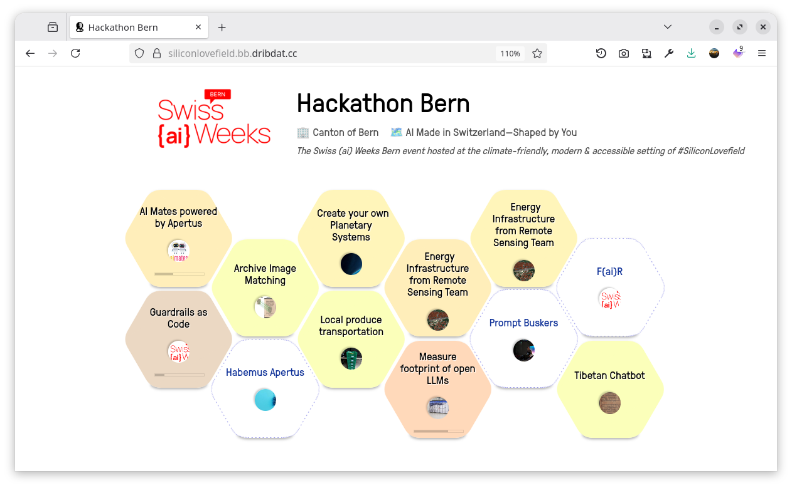
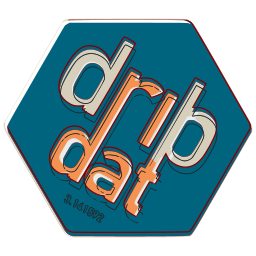

# Driven By Data

<h3>The open platform for data-driven hackathons and hexagonal teams ⬡⬢⬡</h3>

**Dribdat** is an open source &amp; self-hosted ideation and challenge board, that helps you to run code sprints, creative jams, playful hackdays and [awesome](https://awesome.dribdat.cc/) hackathons.

[🏀 Demo](https://demo.dribdat.cc/event/1)
[⚙️ Docker](https://hub.docker.com/r/dribdat/dribdat/tags)
[👍 Deploy](deploy)

<small>Featured site: <a href="https://siliconlovefield.bb.dribdat.cc/" target="_blank">#siliconlovefield 2025</a></small>

### Get started

Please use our [discussion forum](https://github.com/orgs/dribdat/discussions) or [raise an issue](https://github.com/dribdat/dribdat/issues) if you would like to improve the [documentation](https://codeberg.org/dribdat/docs), share feedback, or contribute via Pull Request. You can also use our [Codeberg mirrors](https://codeberg.org/dribdat) to do this.

We aim to include people of all backgrounds in using + developing this tool - no matter your age, gender, race, ability, or sexual identity. Please review and adhere to our [Code of Conduct](https://codeberg.org/dribdat/dribdat/src/branch/main/CODE_OF_CONDUCT.md#contributor-covenant-code-of-conduct) 🏳️‍🌈

- **Write to the 📨 [maintainers](mailto:dribdat@datalets.ch) to get help accelerating your community**
- Read up about the project in the [User Guide](usage), [Purpose](purpose) and 📑 [Whitepaper](whitepaper)
- Visit the 👁️‍🗨️ [Hackfinder](https://hackintegration.ch/hackfinder) to find upcoming events and current research.
- Join our 🧬 [Hack:Org:X](https://hackorgx.dribdat.cc) sessions to meet other hackathon organizers.
- Take a look at the [Modernization Proposal](modernization)
- See our [roadmap](https://github.com/orgs/dribdat/projects/8/views/2) and sign up for the beta at 🔜 [EveryHack.day](https://everyhack.day)
- Find **screenshots** of Dribdat-powered events at 🏀 [Tour de Hack](tour)
- Subscribe to **get updates** on our 🩵 [OpenCollective](https://opencollective.com/dribdat/updates)

 <a href="https://alternativeto.net/software/dribdat/" target="_blank">♥️ Heart on AlternativeTo</a>
 <a href="https://github.com/dribdat/dribdat" target="_blank">⭐ Star this on GitHub</a>
 <a href="https://codeberg.org/dribdat/dribdat" target="_blank">𐂐 Fork on Codeberg</a>

