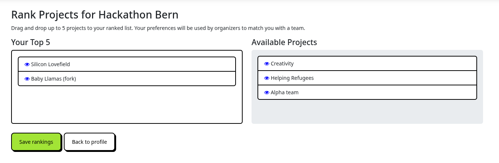
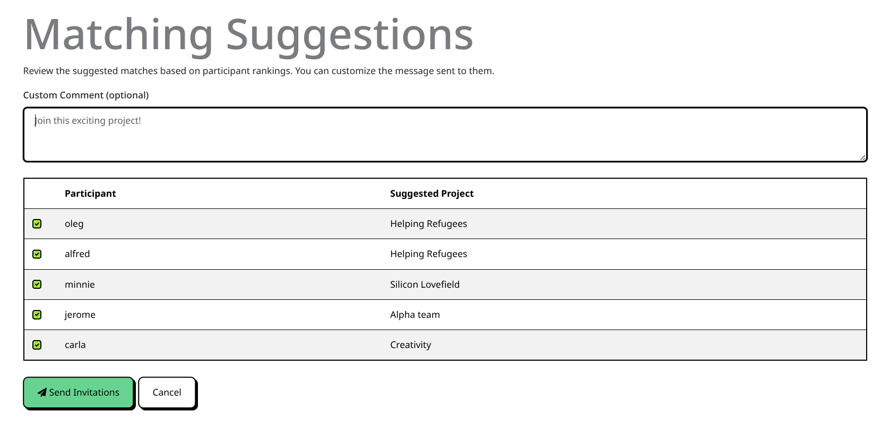
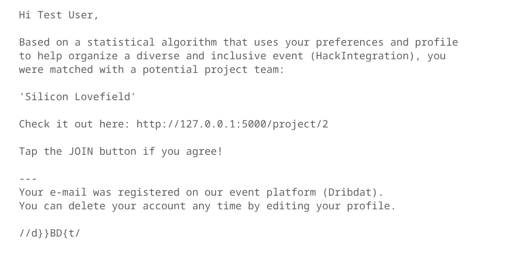

# Teambuilder

Many hackathons, whether remote or on-site, rely on "organic" formation of teams, where people just meet, connect, and agree to work together for more or less the duration of the event. However, many organizers look for more more methodical ways of matching people together. Some reasons to try to do this are:

- improving the onboarding experience
- helping people to 'break the ice'
- promoting more diversity in the teams
- managing online events, and so on

There are several ways people can form teams on Dribdat already, as described in the [User Handbook](usage), you can just Join a project that you like. You can also be manually added to a project by an organizer, who may have built this into a registration form, or found some other ways to assign teams. We recently added a simple dialog that encourages people to fill out a profile and pick a team.

Dribdat now features an optimization-based **matching algorithm** to go a step further, and actively help participants and organizers to form teams during hackathons. The science-based algorithm is implemented using [Pyomo](https://www.pyomo.org/) and solved with the [HiGHS](https://highs.dev/) solver. In this documentation you can find some more information on how it works, and our outlook on this type of feature.

The **Teambuilder** feature is an automated recommendation engine designed to match participants to projects based on their skills, interests, and preferences. Originally developed as an external algorithm by students of Prof. Dr. Marek Pycia at the University of Zürich (UZH), the tool has been successfully integrated into Dribdat as part of the HackIntegration project.

It is now a standard offering in Dribdat, with growing demand from event organizers and participants. Details of the algorithm will be published soon, a basic overview of the approach is described in the following sections.

## User guide

Users can rank up to 5 projects for the current event using an intuitive drag-and-drop interface (powered by SortableJS). This is accessible via the upcoming event page (with the **Join Project**) button, or the user’s profile.



Just drag and drop the projects you would like to work on from the right side to the left, and rank them from top (most preferrable) to bottom.


Organizers can then get an overview of all projects and participants in a single, centralized dashboard in the Admin area. They can at a glance see who has ranked their projects, and start the teambuilding process.



When you trigger the matching process, it suggests optimal assignments based on:

- Participant rankings
- Project capacity and skill constraints
- Pre-made teams (users already joined to a project are kept together)

The results are displayed in a review screen for organizer approval.
Organizers can then send automated invitation emails to suggested matches.



Emails include: basic project details, a customizable message from the organizer, and a direct link for participants to join the project.

Participants must act on the recommendation, i.e. confirm the match by tapping the link and joining the project.

## How the matching works

The matching algorithm considers several factors to find an optimal assignment of participants to projects:

1. **User Preferences:** Participants can rank projects they are interested in. The algorithm tries to assign each person to their highest-ranked project.
2. **Project Capacities:** Each project has a maximum number of members it can accommodate (defaulting to the value of the `DRIBDAT_TEAM_SIZE` environment variable, or 5).
3. **Skill Requirements:** Projects can specify required skills (using the `technai` field). The algorithm ensures that these requirements are met by assigning participants with the matching skills.
4. **Team Imbalance:** The algorithm includes a small penalty for team size imbalance, encouraging teams of similar sizes.
5. **Pre-made Teams:** If a participant has already "joined" (starred) a project in Dribdat, the algorithm treats this as a fixed assignment and keeps them in that project.

## Solver Configuration

The default solver is **HiGHS** (via the `highspy` package), which is an open-source high-performance solver for mixed-integer programming.

### Customization

- **Team Size:** You can set the `DRIBDAT_TEAM_SIZE` environment variable to change the default capacity for all projects.
- **Skill Matching:** Skills are matched between the `User.my_skills` and `Project.technai` fields.

## Development and Testing

The matching logic is located in `dribdat/matching.py`. You can run the dedicated matching tests using:

```bash
PYTHONPATH=. python tests/test_matching.py
```

For more information on optimization models and testing, refer to the [Pyomo documentation](https://pyomo.readthedocs.io/).

## Acknowledgements

Special thanks to Kiril and Martin for their contributions to the Teambuilder algorithm, and to the Bern University of Applied Sciences, University of Zürich, Innosuisse, and all [HackIntegration partners](https://hackintegration.ch) for their support.
