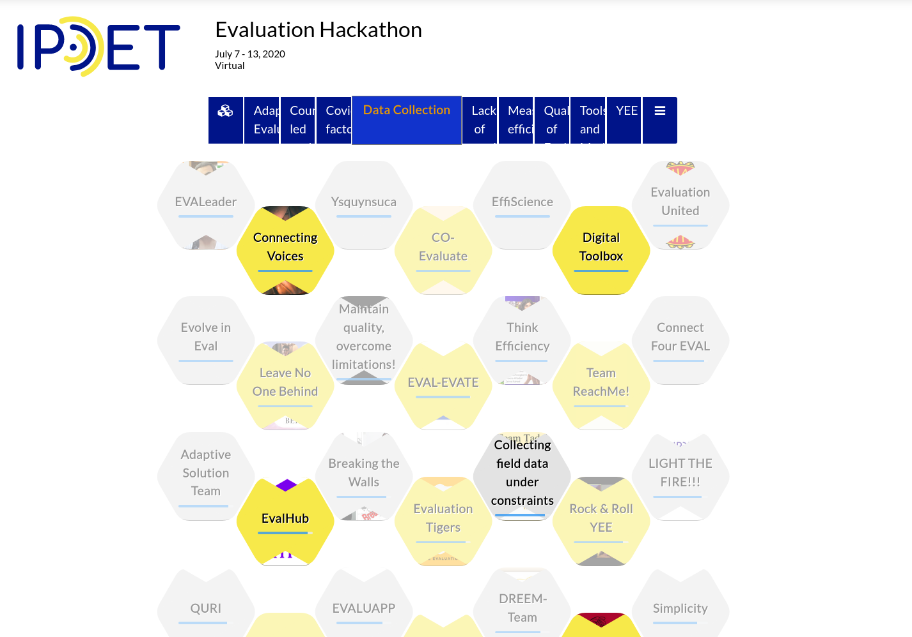
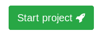
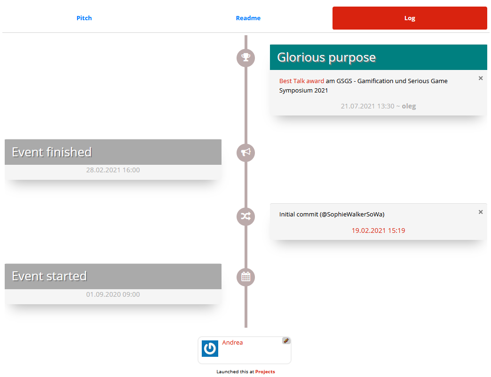
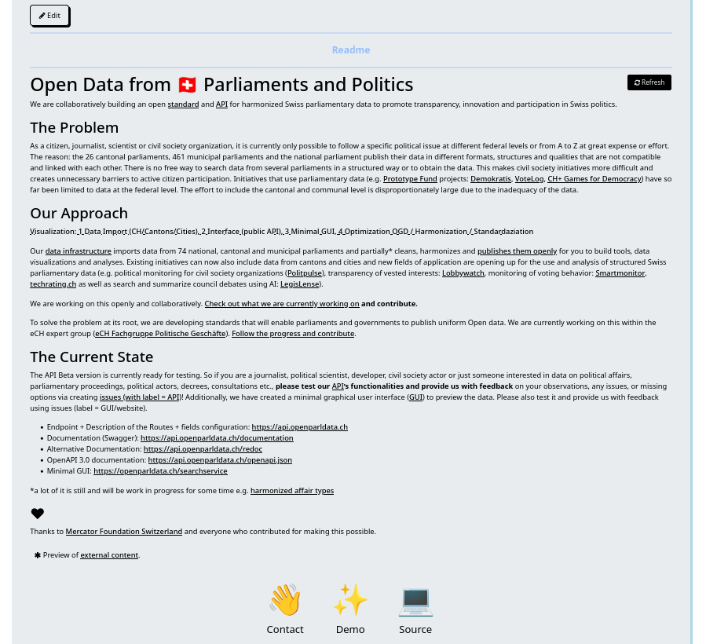
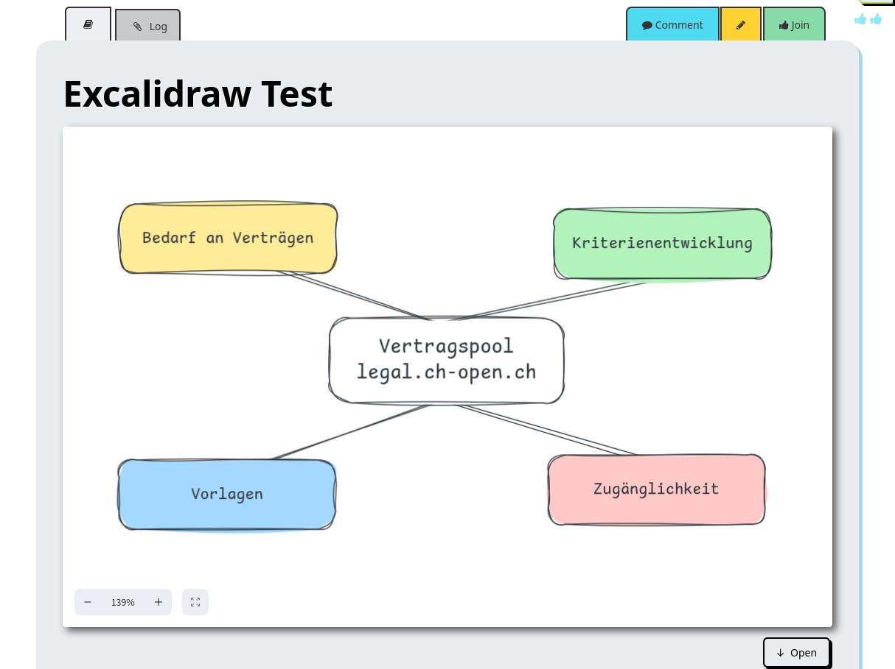
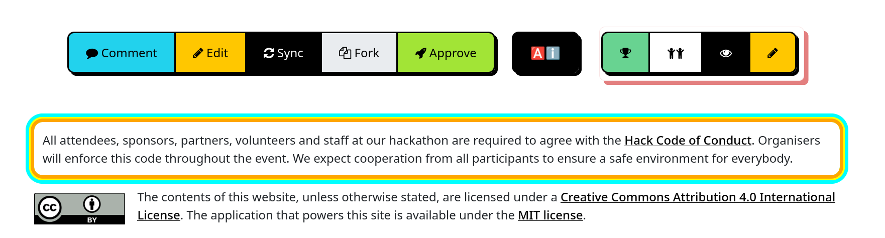
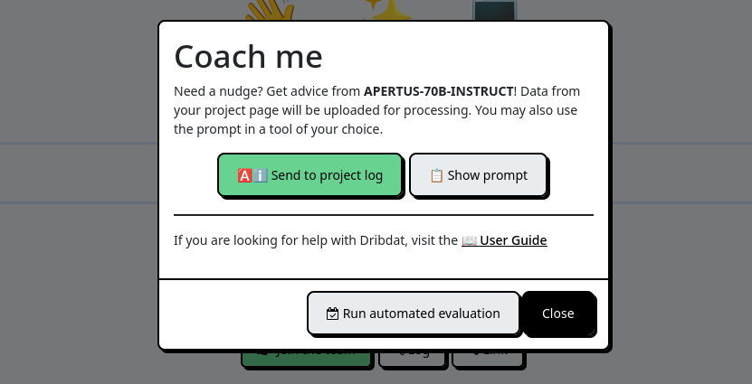
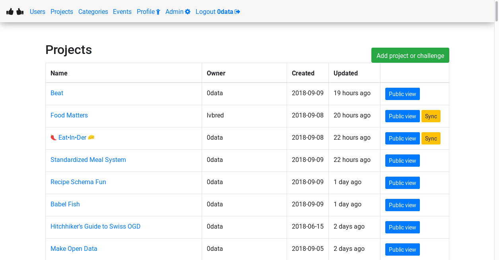
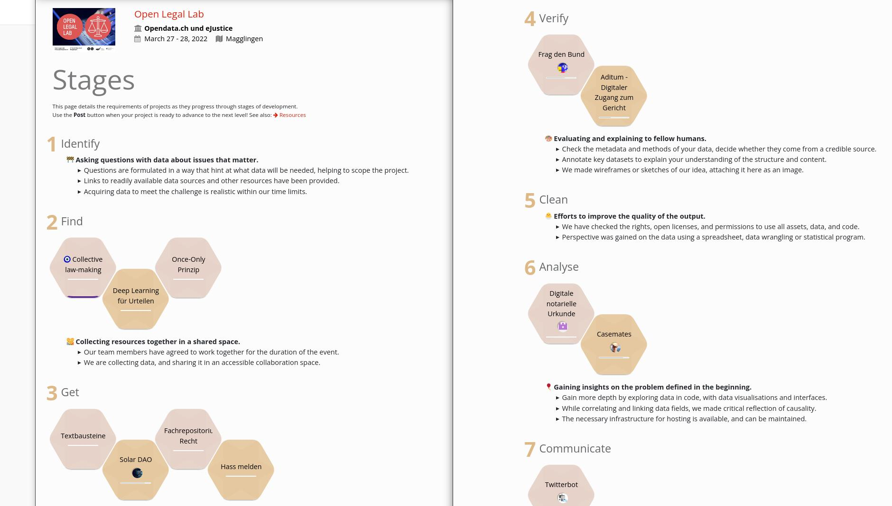

Organiser Guide

---


This document explains how the open source `dribdat` tool can help you to set up data-driven collaborative sprints, such as *[Hackathons](https://hackathon.guide/)*. For basic usage of the application see the [User's guide](usage). For more background see [ABOUT](about), and for technical details visit the [README](https://github.com/dribdat/dribdat#dribdat).

Dribdat helps us to keep things fun and unpredictable at our events. We love hacking on the platform itself, and would love to [hear your feedback](mailto:dribdat@datalets.ch).

# Dear Organiser

What is the core concern of your hackathon? As event organisers, we are really into making the most of time constraints - so the homepage and dashboard feature a big animated countdown clock:


If you have not participated in a Dribdat-powered hackathon before, visit the [Tour de Hack](tour) to see screenshots of an event in the heat of things.

Having a clear and accessible documentation of your event makes it easy for fellow participants to understand the challenge - or what you've worked on in response to it - as well as allow the audience, the jury, and so on, to discover your work and respond to it.

By the way: the name *dribdat* is an amalgam of "Driven By Data" - with a tip of the hat to [Dribbble](https://dribbble.com/), a famous online community for graphic design which was one of the inspirations at the start of the project. We have organised a lot of hackathons over the years, and started this platform to streamline our own efforts.

It is designed with the goal of helping teams - and their facilitators - sustain efforts over time, streamline information channels, and let everyone focus on driving their ideas forward.

## How do you enter content?

Data on projects can be entered into the application directly using text, HTML or [Markdown](https://www.markdowntutorial.com/) formatting. Dribdat features an accessible user-facing frontend for starting and updating projects, and an administrative backend for the organizing team.

Content may also be aggregated (**Sync**-ed) from an external location by putting in the URL to a public project hosted on one of several [supported platforms](sync). For more details on entering content, see the [usage steps](#content).

## Why should we use dribdat?

Creative collaborative events are a playground for creative individuals, and events which focus on sustainable solutions need to encourage good documentation and evaluation. Developed and used for hackathon series, dribdat is designed to involve a diverse user base - in particular those of the Swiss NGO [Opendata.ch](https://opendata.ch/events/). This open source platform built by a community for its own needs has developed over time into a unique solution that is used for a wide variety of events, and every contribution helps to assure the future development of this project.

Logged-in users can submit challenges, ideas and projects by linking their document or repository, or entering details directly into a form. Many customizations to the process and content of the event can be made. You can change or customize the instructions for new projects as you see fit in the Event administration.

## How do I use this effectively?

Once you've signed up for a challenge, found a team and joined a group channel, you will soon start brainstorming daring and innovative solutions. Use dribdat to keep a notebook, post updates about your team's progress, accelerate your collaboration efforts and get ahead of the game to rock your pitch at the end.

# What to explain to users

Here we explain the steps that your users typically would go through in using dribdat. Feel free to copy and paste and adapt this into your event documentation:

### 1. Sign in

Click **Login** at the top of the page and either use the e-mail and password to register and log in, or for servers that are connected to supported providers of Single Sign-On that you can enable in dribdat.

If you have issues logging into the platform, contact the organizing team of your event for help.

### 2. Find your team

Every active team should have a public project page on dribdat.

These are sometimes categorized according to the challenge topic they address at the top of the event page, which is a kind of digital map. The button at the far right (&#9776;) switches to a list mode, which can also help you to find your team if there are a lot of challenges.

Here is an example from a large Dribdat-powered event, which uses categories:



If your team does not yet have a project, then you may (administrators can disable this) be able to create one with the green **Start project** button (which is called **Announce Challenge** before the event begins) to create a project:



Once you have found your group, open the project page, and tap on the blue **Join** button at the top. You should then see your name along with any other team members listed underneath. You can also Leave (click the ★ blue star) the project if you joined one by accident.

If you need to make changes or link your name to somewhere on the Internet, click **Profile** in the top of the page.

### 3. Post an update

Once you join a project in step (2), buttons appear at the top of the page allowing you to *Post* and *Edit* updates about your experience.


By clicking the **Post** button, you can give a quick status report of your progress. A dialog box asks you to self-evaluate your team's **Progress**, as well as enter a few words or sentences to describe at which [project stage](#stages) you are at in the process. You can find these posts in the project **Log**:



Try to use this regularly to keep tabs on how and your team are spending your precious time at the event. It will help you to learn from the experience and think of improvements for next time.

> **dribs** *n. pl.: in small amounts, a few at a time*

### 4. Share your results

If you need to make other changes to your project, click the **Edit** button. You will also see other fields there allowing you to set up how your project is presented. There are three basic ways to share your team's efforts: 1) a free form Description, 2) external content via Sync, and 3) external content in a frame with the Project link.

In the large **Description** field you can post notes on your final results, such as a video or slide presentation, summarizing in free form your solution to the challenge. This can be plain text, in HTML or Markdown. If you need to add an image, use a cloud hosting service like Imgur and paste the link in like this: ``

As noted at the top of this guide: if you are using GitHub, Google Docs, a wiki, etc., to write your documentation, you don't need to copy and paste it into dribdat. Use the [**Sync** capability](sync) to automatically scrape the contents of your README or webpage into your project. Pretty hacky, huh? `;-)`



You can also use the **Project link** to embed documentation you are working on elsewhere into a frame on your project page. This could be a demo of your application, or - in the early phases at least - collaboration tools for your team.

For example, if you are using a wireframing tool and can share it with a public link, add it to the page using the Project link and enable **Embed** mode to have it update automatically as you work on it - like in this screenshot featuring [Excalidraw](https://excalidraw.com):



Shared text documents, a folder full of sketches, datasets, and any other online materials can be showcased in this manner. Put whatever is currently the most actively developed prototype at the top, and list links to any other relevant materials in your description or project updates.

### 5. Keep a beginner's mind

Have you never participated in an event, where you were not quite sure what you can contribute, you do not know anyone yet here, or are just stuck? In the header bar you will find a link to the **Community** - most likely a chat channel or forum - where people are posting questions and support issues.

In the same vein, adding a **Contact** link to your project which points to your team's chat channel or Issues page helps to connect you to (hopefully very constructive) criticism and encouragement from the audience.

Remember: *there is no such thing as a stupid question.*


# Further questions

## How is the work evaluated?

Anyone can leave a suggestion and constructive commentary with the 🗨️ **Comments** button on a project page. As an administrator, you get a special **Boost** button (🏆) to assign awards and motivate your participants.



Newer versions of Dribdat even feature an AI-evaluation feature, which you can connect to your choice of LLMs, with criteria stipulated in the **Submission guide** of your event.



At the bottom of the project page (administrators: use the Community Code field) you may embed a tool with which visitors to your project can leave a quick public commentary or just an Emoji in response to what they see.

You can also add a GitHub widget to a project page by adding the link to the repository on it's own line in your Pitch. This shows the number of "Stars" and "Forks" the project has received.

## What about Intellectual Property?

The teams are free to decide for themselves which license conditions apply to their work. However, open access allows for the best evaluation, so we are stipulating a *Creative Commons license by default* which will apply to any project documentation which is not explicitly adherent to a different license or conditions.

We also typically encourage organizers to adopt the [Hack Code of Conduct](https://hackcodeofconduct.org/).

You can add both with this snippet in your event's **Community code**:

```
<div class="codeofconduct">All attendees, sponsors, partners, volunteers and staff at our events are required to agree with the <a href="https://hackcodeofconduct.org/" target="_blank">Hack Code of Conduct</a>. Organisers will enforce this code throughout. We expect cooperation from all participants to ensure a safe environment for everybody.</div>

<br><p><a rel="license" href="http://creativecommons.org/licenses/by/4.0/" target="_blank"></a>The contents of this website, unless otherwise stated, are licensed under a <a rel="license" href="http://creativecommons.org/licenses/by/4.0/" target="_blank">Creative Commons Attribution 4.0 International License</a>.</p>
```

## What can I do in the back end?

The administrative interface shown below allows defining details of the event and managing project data.



Here you can see challenges and projects, with a rating of how completely they are documented. In the `Events` screen there are links to a *Print* view for a summary of all projects on one page, and the ability to *Embed* results into another website. The look and feel of the projects as well as instructions for teams can be customized per-event.

You can pre-configure **Categories** for your site or a specific event, as well as **Roles** in the `Presets` section of the admin. For example, you could define the following Roles:

- 🖍️ Designer
- ⚙️ Enabler
- 💡 Facilitator
- 🛡️ Organizer

<a name="stages"></a>

## How do project Stages work?

One of the unique features of Dribdat is the progression of projects through a series of stages. You can see this in various ways - the progress bar on top of every project, or in the Stages screen on every event:


<hr>

Out of the box, your projects advance through a series of stages inspired by the [School of Data Pipeline](http://toolbox.schoolofdata.ch/overview.html), which you can also configure to follow a different methodology. At the end of the event, the teams, audience and organizers should have an excellent overview of the work that was done during the event, see the progress of the documentation at a glance, and export data for analysis using the administrative console. The [Whitepaper](whitepaper/) has additional background.

The stages are defined in a [stages.yaml](https://github.com/dribdat/dribdat/blob/main/dribdat/templates/includes/stages.yaml) configuration file. Here you can change the names and contents and rules of every stage, even remove or add stages to your liking. For example, to make sure people put at least 10, but not more than 50, characters in their project summary, add this validation rule to the appropriate stage:

```yml
validate:
        -
          field: summary
          min: 10
          max: 50
          help: Your challenge should have a short summary.
```

Either modify the file on your local filesystem, or use the `DRIBDAT_STAGE` environment variable to point to an online location of your configuration.


See the [Whitepaper](whitepaper#excellent) for more background, and [Tour de Hack](tour) for screenshots.


*Photo credit: MakeZurich 2018 by Christina Rieder CC BY-SA 4.0*

## What if I want to use Dribdat elsewhere?

You can get links to a free copy of the software on our website - or just ask the organising team at a dribdat-powered event for leads. We will be happy to get you any help you need to get started.

Here we have covered some ways of organising and extending Dribdat functions with additional tools. Check out [awesome-hackathon](https://github.com/dribdat/awesome-hackathon) for further inspiration and literature.

Please contact the maintainers [by email](mailto:dribdat@datalets.ch) if you have further questions. If you have any other questions or suggestions, please leave them in our [Issues](https://github.com/dribdat/dribdat/issues).

<tt>Happy hacking! &lt;3</tt>
