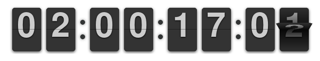

About Dribdat

---

Built around Web-friendly standards like [Schema.org](https://schema.org) and [Frictionless Data](https://frictionlessdata.io), **Dribdat** (from "driven by data") is an [MIT licensed](https://codeberg.org/dribdat/dribdat/src/branch/main/LICENSE) project in an open source ecosystem. It features handy bootstraps (authentication, file uploading, data import/export, etc.), useful workflows (announce an event - publish challenges - form teams - develop projects) and diverse channels (social media sharing, digital signage, summary reports).

Of course, we could also just make a simple website, but, ask yourself, _how hacky would that be?_

<small>Image: [The Q](https://www.youtube.com/channel/UCZdGJgHbmqQcVZaJCkqDRwg) via [The Awesomer](https://theawesomer.com/making-a-cardboard-f1-car/508108/)</small>

# Purpose

It begins with a countdown, defining the start and finish of a time-boxed event:

At the heart of Dribdat is a hexagonal visualization of your teams, showing their relative progress at a glance:

Created in light of the [Hacker ethic](https://en.wikipedia.org/wiki/Hacker_ethic), the Zen of Dribdat is (in a nutshell):

- **Commit sustainably**: archive collected results in open, web-friendly data formats.
- **Live and let live**: share designs, dev-envs, docs accessible to your entire team.
- **Co-create in safe spaces**: promote safer conduct, balancing openness with privacy.
- **Appreciate hexagons:** 120° of symmetry imply community resilience and social good.

Dribdat sprints (see [Tour de Hack](tour) for some examples) typically involve open licenses ([Creative Commons](https://creativecommons.org/licenses/), [Open Data Commons](https://opendatacommons.org/licenses/odbl/), etc.), community-developed templates ([School of Data Pipeline](https://schoolofdata.org/methodology/)), or governance instruments ([Hack Code of Conduct](https://hackcodeofconduct.org/)).

Empowering thousands of people to prototype using public data and open source code, Dribdat is the official platform of [Opendata.ch - Swiss chapter of Open Knowledge](https://opendata.ch), and has been used to host dozens of events in the Swiss [open data](https://hack.opendata.ch), [open hardware](https://now.makezurich.ch), and [open source](https://hacknight.dinacon.ch) community.

Our project started from a [Cookiecutter](https://www.cookiecutter.io/), striving in itself to be an example of a hackable project that can be adapted to other needs and causes.
It can be used just as a Python-powered backend to aggregate data from Gitea, GitHub, GitLab and other repositories and fileshares in one place.

There is a `Vue.js`-based [Backboard app](https://github.com/dribdat/backboard) (shown above) and a `Node.js` [Chatbot](https://github.com/dribdat/dridbot) available as alternatives to the default Bootstrap user interface, easily customized with a bit of `CSS`.
You can customize the layout and presets in an admin panel, or with `YAML` configuration files.

All the data is aggregated with an [open standard](https://json.everyhack.day) (`hackathon.json`), and can be exported in various formats at any time.
There is more on this in the [User Guide](usage) and [Whitepaper](whitepaper).

Visit the 👁️‍🗨️ [Hackfinder](https://hackintegration.ch/hackfinder) to find upcoming events and current research, and join our ongoing 🧬 [Hack:Org:X](https://hackorgx.dribdat.cc) sessions to meet other hackathon organizers.

See also our [roadmap](https://github.com/orgs/dribdat/projects/8/views/2?pane=issue&itemId=89596986) and sign up for the beta 🔜 [EveryHack.day](https://everyhack.day)
