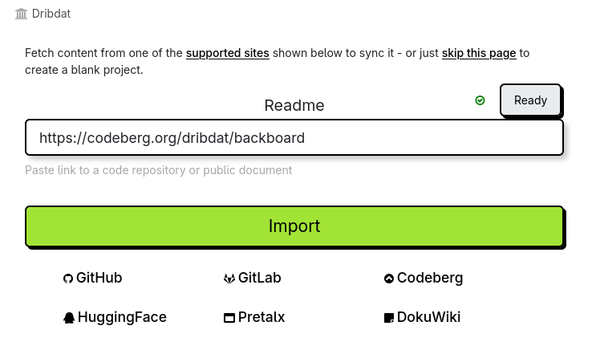
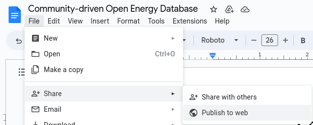
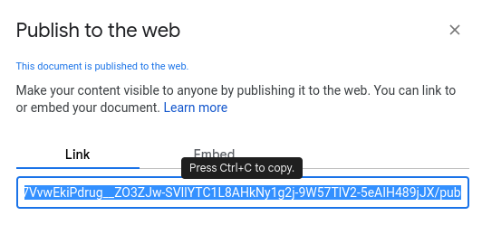

Sync and Readme

---

We do not force or even expect you to use the editor on this platform to work on your content.
Some teams are content with just adding a link to their Demo or uploading their Pitch presentation into Dribdat.

# Open collaboration

You can sync your content when adding a new challenge or project using the **Import** screen:

This feature allows you to connect documentation from your open source repository on [GitHub](https://github.com), an online document at [Etherpad](http://etherpad.org), and many other collaboration platforms - see the list below.

When you **Edit** your project, you can find the **Readme** in the **Details** tab. 
Visit the [User guide](usage) to learn more about editing content in Dribdat.

## Staying in sync

Once you put the URL to your remote content into the **README** field when creating a new project. Or find it in the **Details** editor on an existing challenge or project, the content will be fetched, and you will be notified if there are any errors.

From time to time - such as when writing a Post - the data will be refreshed. You can use the **Sync** (synchronise) button on the bottom of your project page to refresh your changes at any time. Administrators can also selectively Sync projects, or all at once in the project list.

Even if you have a Readme, you can still _Edit_ your project to add notes or answer questions relevant to the event you are at, and _Details_ to tweak the Contact, Download, Source, Image links and more.

Note that for source code repositories, some additional content is fetched, such as links to source code or demo. To clear the README, just remove the link.

## Supported sites

- [Codeberg](https://codeberg.org/) (Gitea)
- [GitHub](https://github.com)
- [GitLab](https://gitlab.com)
- [Bitbucket](https://bitbucket.org)
- [Pretalx](http://pretalx.com)
- [Etherpad](http://etherpad.org)
- [HackMD](https://hackmd.io) and [CodiMD](https://codimd.web.cern.ch/)
- [DokuWiki](http://make.opendata.ch/wiki/project:home)
- [Google Docs](http://docs.google.com) (* you must enable "Publish to web", as shown below)

Leave us [an issue](https://codeberg.org/dribdat/dribdat/issues) or drop into the [Discussions](https://github.com/orgs/dribdat/discussions) if you have ideas for other data sources we should support.

### Using Google Docs

A special note if you are trying to attach a document from Google Drive. 

If you want to use Google Slides to make a presentation, it is best to Publish to Web, and copy the Embedding link (just the URL) as your Presentation link. The following applies to attaching the contents of Google Docs:

Activate publishing in this dialog, and finally copy the link that is shown, so that you can paste it into the README of your dribdat project:

