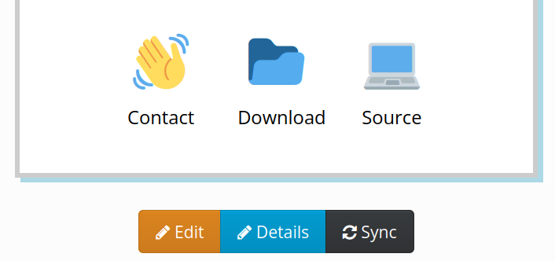

This page provides some additional details on the **Sync** feature. For more background, visit the [User guide](usage).

# Synchronisation ("README")

We do not force or even expect you to use the editor on this platform. The Sync/README feature allows you to connect documentation from your open source repository (see list below). 

To use this function, just put the URL to your remote content into the **README** field when creating a new project. Or find it in the **Details** editor on an existing challenge or project.

Use the **Sync** (synchronise) button on your project page to refresh your changes at any time. You can still _Edit_ your project to add notes or answer questions relevant to the event you are at, and _Details_ to tweak the Contact, Download, Source, Image links and more.

The contents of all projects in an event can be synced by the admin, and this happens automatically from time to time as you work with your project.

# Supported platforms

- [Codeberg](https://codeberg.org/) (Gitea)
- [GitHub](https://github.com)
- [GitLab](https://gitlab.com)
- [Bitbucket](https://bitbucket.org)
- [Instructables](http://instructables.com)
- [Etherpad](http://etherpad.org)
- [HackMD](https://hackmd.io) and [CodiMD](https://codimd.web.cern.ch/)
- [DokuWiki](http://make.opendata.ch/wiki/project:home)
- [Google Docs](http://docs.google.com)*

## 💡 Tips

For **Google Docs** you must enable "Publish to Web":

Then activate publishing in that dialog, and finally copy the link that is shown, so that you can paste it into the README of your dribdat project:

