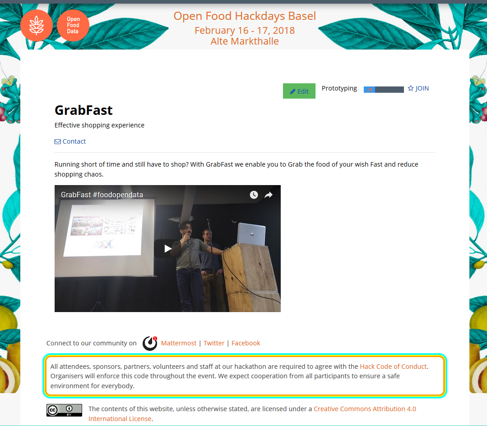
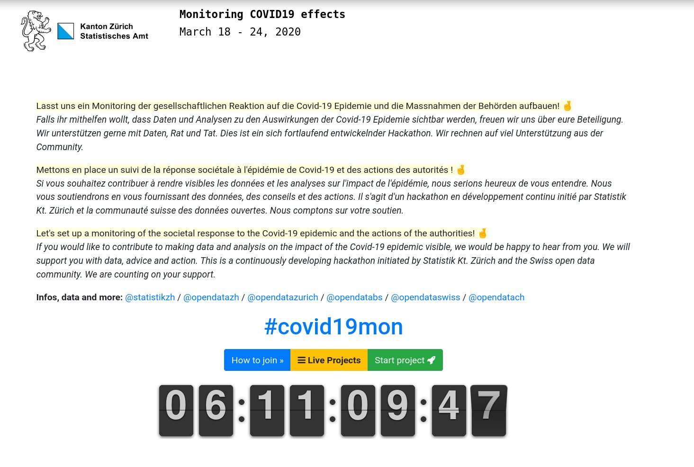
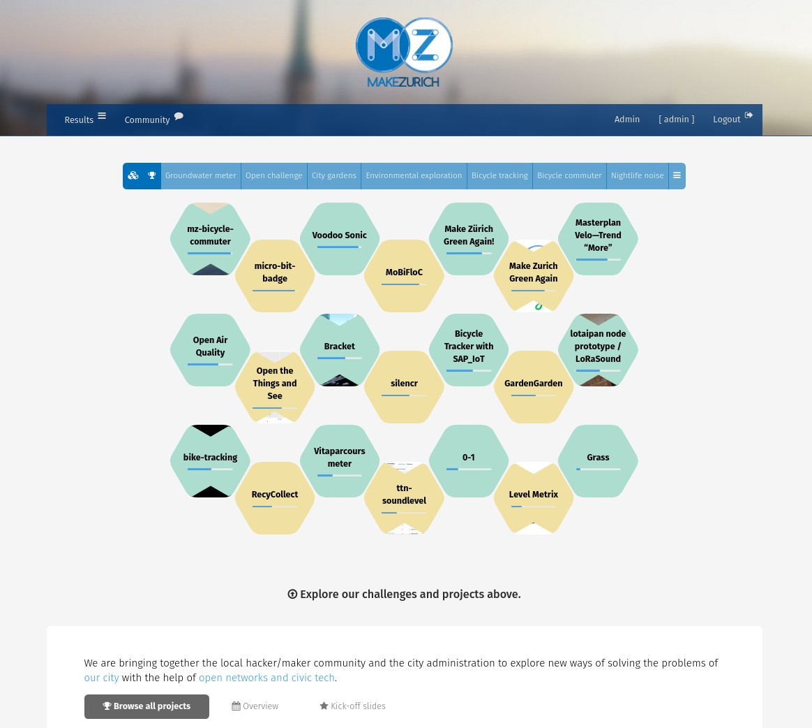
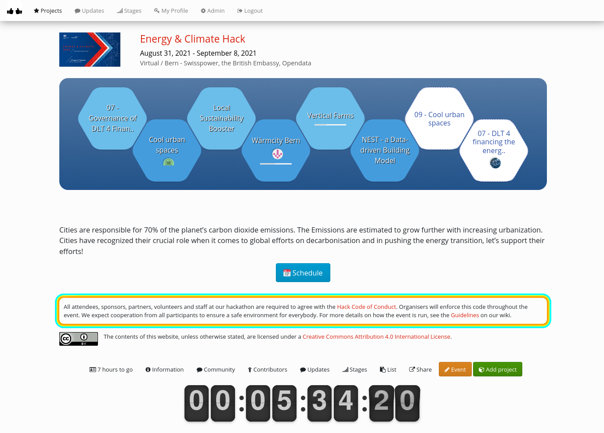
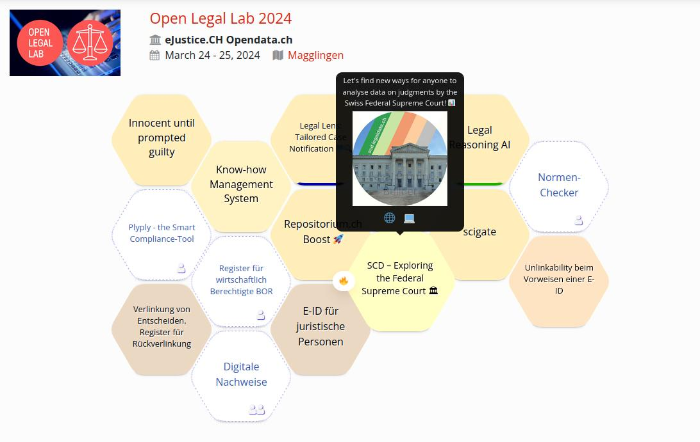
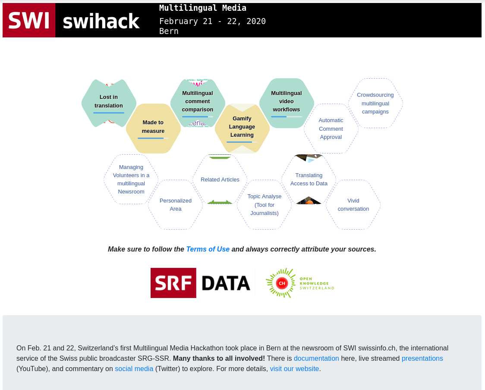
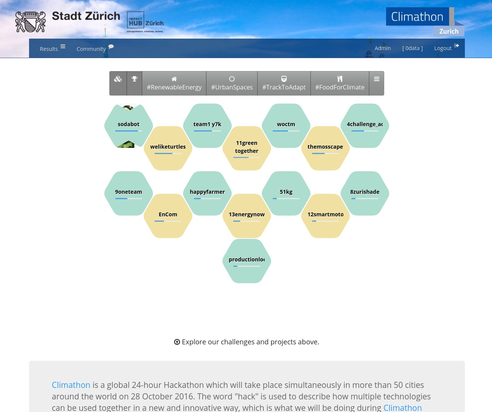
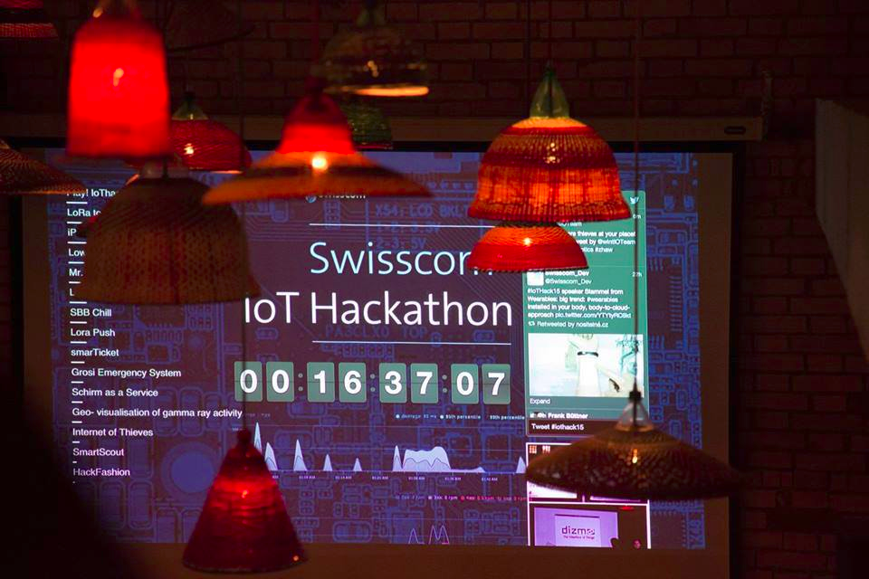

# Tour de Hack

On the following pages are a sampling of reference Dribdat deployments with some background information from **2015 - 2025**.
See the [Whitepaper](whitepaper) for more background and [History](history) for more detailed history.

---

## Open Data Hackdays

*Since 2016, dribdat is the official platform of Opendata.ch Hackdays.*

- **User:** Opendata.ch - Swiss Chapter of Open Knowledge
- **Results:** [hack.opendata.ch](http://hack.opendata.ch/event/18)
- **Discussion:** [log.alets.ch](https://log.alets.ch/039/)
- **Integrations:** Datacentral, CKAN, Discourse, GitHub, Slack

---

## Monitoring COVID-19

*The open data community at the front-lines of a digital response to the COVID-19 pandemic.*

- **User**: Canton of Zürich
- **Results:** [db.schoolofdata.ch](https://db.schoolofdata.ch/event/7)
- **Discussion:** [forum.opendata.ch](https://forum.opendata.ch/t/18-3-1-year-of-covid19mon/757)
- **Integrations:** Mattermost, GitHub

---

## MakeZurich

*An interest to accelerate hackathons using the Internet of Things is at the heart of dribdat.*

- **User**: Open Network Infrastructure Association
- **Results:** [now.makezurich.ch](https://makezurich.dribdat.cc/) (Archived)
- **Discussion:** [forum.opendata.ch](https://forum.opendata.ch/t/22-30-6-makezurich-2018/372)
- **Integrations:** Slack, GitHub, The Things Network

---

## Energy & Climate Hack

- **User:** Swisspower, Opendata.ch
- **Results:** [hack.opendata.ch](https://hack.opendata.ch/event/36)
- **Discussion:** [forum.opendata.ch](https://forum.opendata.ch/t/31-8-1-9-energy-climate-hack/783)
- **Integrations:** Slack, Google Drive, GitHub

---

## Open Legal Lab

- **User**: eJustice CH
- **Results:** [challenges.openlegallab.ch](https://web.archive.org/web/*/https://challenges.openlegallab.ch/) (Archived)
- **Discussion:** [forum.opendata.ch](https://forum.opendata.ch/t/27-28-3-open-legal-lab/814)

---

## Evaluation Hackathon

- **User:** International Program for Development Evaluation Training
- **Results:** [evalhack.org](https://web.archive.org/web/20230331121348/https://ipdet.evalhack.org/) (Archived)
- **Discussion:** [opencollective.com](https://opencollective.com/dribdat/updates/a-season-of-hackathons)
- **Integrations:** Slack, Disqus, YouTube

---

## Multilingual Media

- **User:** Swissinfo
- **Results:** [db.schoolofdata.ch](https://db.schoolofdata.ch/project/58)
- **Discussion:** [blog.datalets.ch](https://blog.datalets.ch/065/)
- **Integrations:** CodiMD, GitHub, YouTube

---

## Climathon Zurich

- **User:** City of Zürich
- **Results:** [hack.opendata.ch](http://hack.opendata.ch/event/4)
- **Discussion:** [blog.datalets.ch](https://blog.datalets.ch/023/)
- **Integrations:** Slack, Hubot (sodabot), GitHub

---

## Internet of Things

*The first release of dribdat was designed in cooperation with Swisscom. Image courtesy of [Impact Hub Zürich](https://zurich.impacthub.ch/de/cross-sector-innovation/).*

- **User:** IoT Zürich Community
- **Results:** [iot.dribd.at](https://web.archive.org/web/20160908224655/http://iot.dribd.at/) (Archived)
- **Discussion:** [iot-hackathon.swisscom.com](https://web.archive.org/web/20190701230005/http://iot-hackathon.swisscom.com/) (Archived)
- **Integrations:** Slack, GitHub, Twitter, Instagram, Heroku, custom hardware

