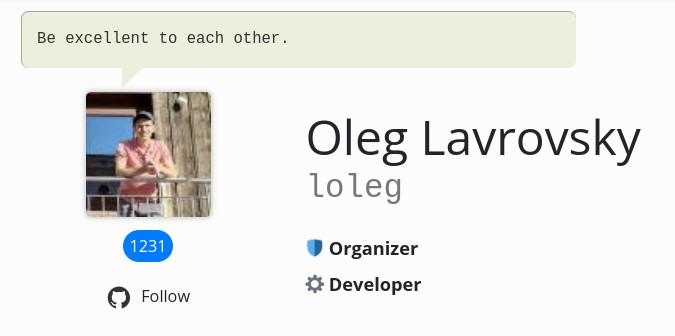
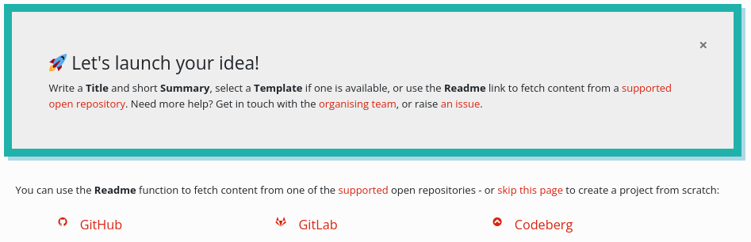
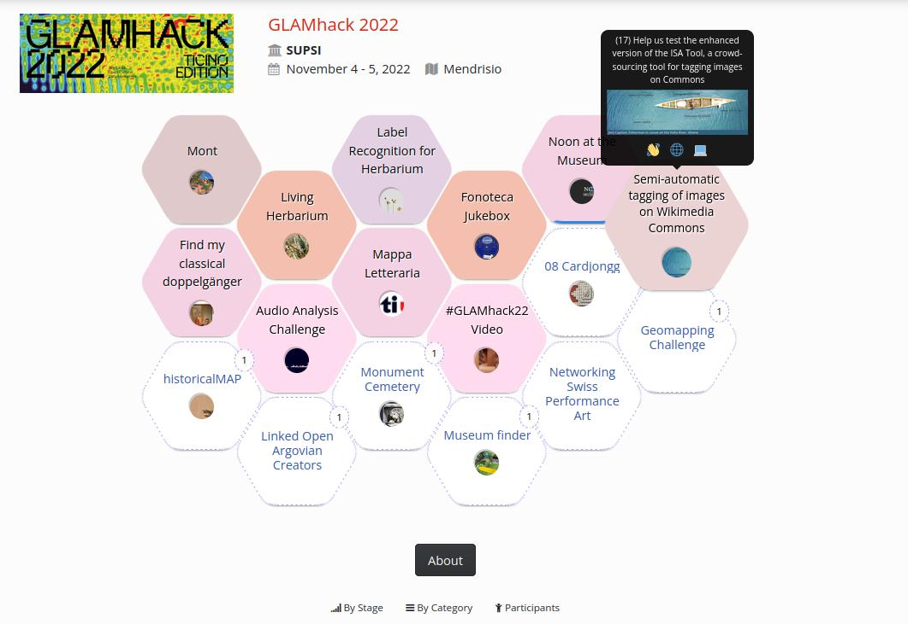
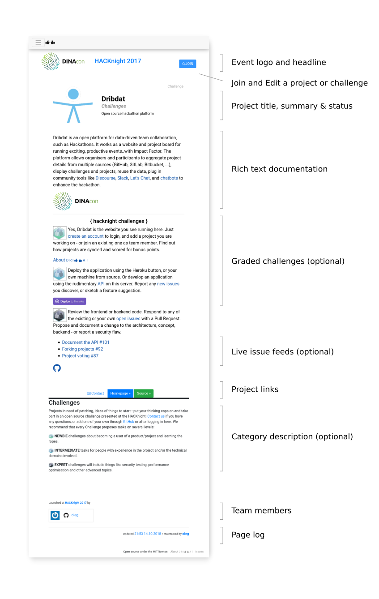
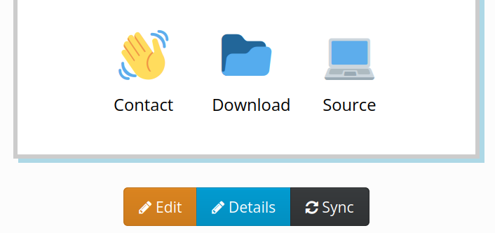
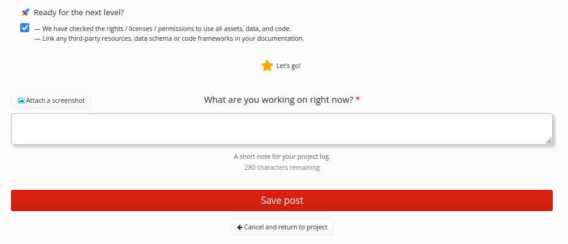
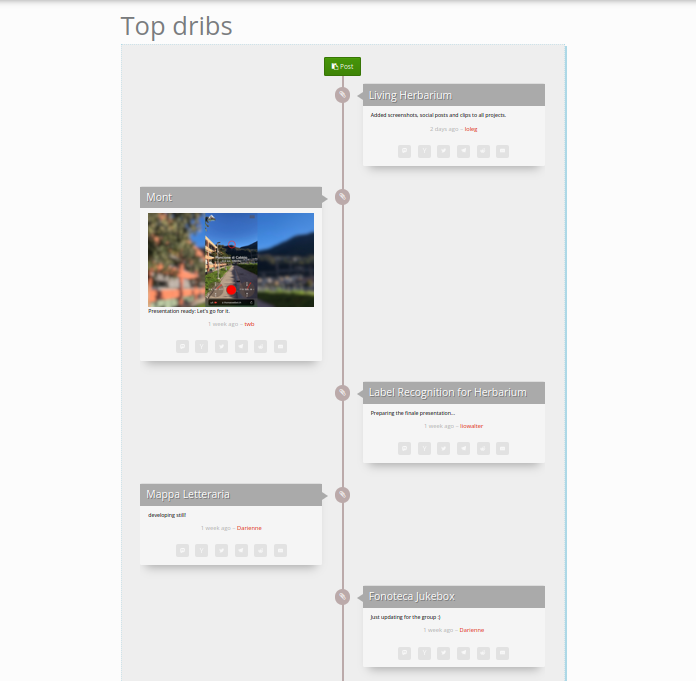
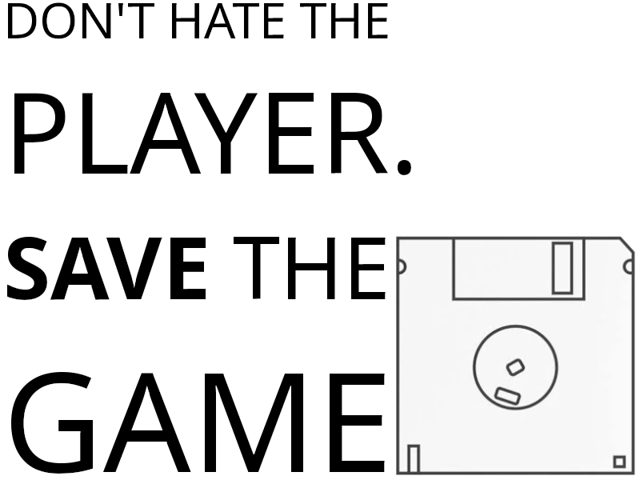

User handbook

---

This page explains Dribdat, an open source platform for data-driven team collaboration (such as *[Hackathons](https://hackathon.guide/)*), covering the basic usage of the application. For more background see [ABOUT](about), and for technical details visit the [README](https://github.com/dribdat/dribdat#dribdat).
For a printable version of this document see [📄 Handbook for hackathons powered by Dribdat](https://docs.google.com/document/d/e/2PACX-1vR5Gv5NA3pkls0FRufC0dg-blkOhSo1LMX58pSNtj0FhZq1ImmLw0cIwmla_hiZaxtP8tnzJQQgZg94/pub)

# Dear Participant

**Dribdat** (from Driven by Data) works as an online multitool and project board, incorporating best practices from community building, such as templates for 🌳beginner 😄intermediate 🏀advanced level challenges, a 7-stage process for effective data-driven projects, connectivity to popular collaboration platforms, and time-tracking utilities.

So what are we waiting for? Let's get started!

## Quick start

Open the page of an event, log in and create a user **Profile**. Then you can explore the existing challenges at your event. Keep an eye on the unfilled Roles (🖍️Designer ⚙️Enabler 💡Facilitator etc.) that are shown on the bottom of the project page, if you are not sure which team you should support. You can then leave a **Comment** or **Join** the challenge.

Before the event starts, you may also be able to submit a **New** challenge, along with a summary of your idea. This could be linked to a supported design tool or code repository. Once you have a project page, you and any of your team members can click the **Join** button to make changes and contribute updates.

A typical Dribdat-powered event (this is from [GLAMhack](https://hack.glam.opendata.ch/) - the Swiss Open Culture Data hackathon) has a variety of challenges and projects at different stages, which you can explore in a hexagonal grid:

### Leap into action

Use your project page to document what makes your ideas tick. Post a creative 30-second **Pitch** using plain text or [Markdown](https://github.com/adam-p/markdown-here/wiki/Markdown-Cheatsheet). There is an editor you can activate which helps you learn this widely used formatting style. 

Feeling hacky? Use the Pitch to write your presentation with a few simple statements and [Marpit Markdown](https://marpit.marp.app/markdown) formatting, then **✓ Enable slide mode**.

If you upload a PDF as your presentation, or link to a website (look for a [Publish to Web](https://knowledge.workspace.google.com/kb/publish-docs-sheets-slides-or-forms-as-web-pages-000008504) or [Embed code](https://support.microsoft.com/en-us/office/embed-a-presentation-in-a-web-page-or-blog-19668a1d-2299-4af3-91e1-ae57af723a60)), this will also be shown at the top of your project.

You can add links to sound or video clips, embed documents or a slideshow hosted on a site like [Speaker Deck](https://speakerdeck.com/). Content from many [supported sites](https://oembed.com/#section7) will turn into a live preview.

The picture below explains the various parts of a typical challenge or project page:

## Sync your stuff

We do not force or even expect you to use the editor on this platform to work on your content.
Some teams are content with just adding a link to their Demo or uploading their Pitch presentation into Dribdat.

**Edit** your project to add notes or answer questions relevant to the event you are at, and **Details** to tweak the Contact, Download, Source, Image links and more.

The **README** feature allows you to connect documentation from your open source repository on [GitHub](https://github.com), an online document at [Etherpad](http://etherpad.org), and many other collaboration platforms.

💡 See the [How to Sync like a Pro](sync) for more details.

To use this function, just put the URL to your remote content into the **README** field when creating a new project. Or find it in the **Details** editor on an existing challenge or project.
Use the **Sync** (synchronise) button on your project page to refresh your changes at any time. You can still _Edit_ your project to add notes or answer questions relevant to the event you are at, and _Details_ to tweak the Contact, Download, Source, Image links and more.
The contents of all projects in an event can be synced by the admin, and this happens automatically from time to time as you work with your project.

### Supported README sites

- [Codeberg](https://codeberg.org/) (Gitea)
- [GitHub](https://github.com)
- [GitLab](https://gitlab.com)
- [Bitbucket](https://bitbucket.org)
- [Pretalx](http://pretalx.com)
- [Etherpad](http://etherpad.org)
- [HackMD](https://hackmd.io) and [CodiMD](https://codimd.web.cern.ch/)
- [DokuWiki](http://make.opendata.ch/wiki/project:home)
- [Google Docs](http://docs.google.com) (* you must enable "Publish to web", as shown below)

### Using Google Docs

Activate publishing in this dialog, and finally copy the link that is shown, so that you can paste it into the README of your dribdat project:

## Keep tabs on your progress

By updating your progress using the **Post** button, you can regularly check in your team's status or any roadblocks. You may see a couple of tips for completing or advancing your project at the top of the screen. You can find this button on the top of any projects you have joined, or on your profile page (which takes you to your latest team).

### Keep tabs on everyones progress

Having a readable, regularly updated overview of what your team is working on is your secret weapon in collaborative projects. Release early, release often, and use the power of evaluation for quick feedback to your experiments. Then rock that stage with your results!

The posts are visible in the **Log** section of your project, in the **Dribs** global firehose, and on your profile as a **Personal Log**. As an organizer, this can help you to have an overview of all the teams, and what stage they are at.

Of course you can also cross-post to a variety of social networks to boost your online rep from here!

That's all there is to it, as a user. Read the [Organiser's guide](organiser) if you'd like to see more details about running your own event.

---

