Co{re}creation for civic hackers
---

// v.2.8 /// 8.2022

> This paper describes **dribdat** as an open development platform for technical sprints and data expeditions. A simple user interface allows managing challenges, resources and bootstraps, while augmenting tolerance and fairness among participants. See how we use it to support teams in hackathons and workshops. By fostering and connecting design notes, data, and code, let's make the experience of exploring real world problems hands-on _even more awesome!_

Permalink: [docs.dribdat.cc/whitepaper](https://docs.dribdat.cc/whitepaper/)

**Contents**

1. [Executive summary](#summary)
2. [For corecreation](#collaboration)
3. [An open platform](#results)
4. [Reducing friction](#friction)
5. [Assuring interoperability](#interoperability)
6. [Being excellent to each other](#excellent)
7. [What's next in the pipeline](#things)
8. [The open alternative](#alternative)
9. [Always be closing](#closing)
10. [References](#references)

---

# ➀ executive summary

Using dribdat, you can start and showcase projects at collaborative events. These are most commonly hackathons: a popular event format for tinkering and innovation in small teams. Developed within the civic tech movement, concerned with open access to data and sharing the knowledge associated with data production and reuse across diverse local communities, dribdat was created as a tool for organisers and participants to have a good overview of the goals and results of their meetings.

We encoded our principles in the form of an online, web-based application to ensure that our contributions are easily accessible and verifiable. It helps everyone when the executive summaries, or _Pitches_, of our projects get published using good standards. This helps to make open design workshops more sustainable, when the experiences gained to be more easily discoverable, readable, and reproducible.

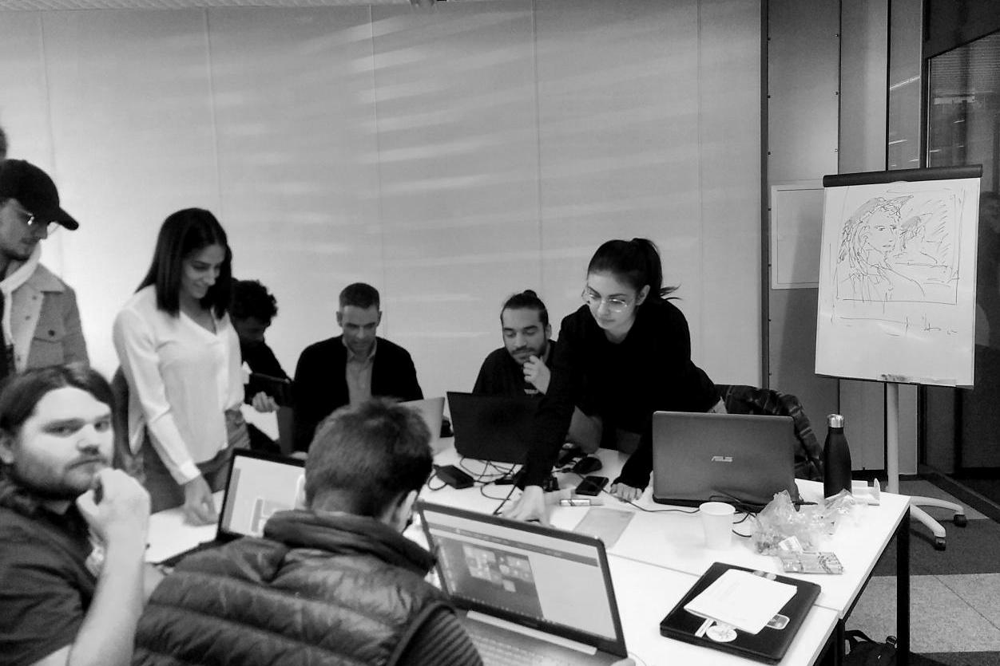

When citizens engage in open development to hack on projects - such as monitoring the environment or validating public accounts - sometimes longer-term initiatives emerge. The shared premise is that open source code and openly designed hardware can be used in our digital society to rapidly prototype and assess the real-world potential and impacts of ideas or "challenges".

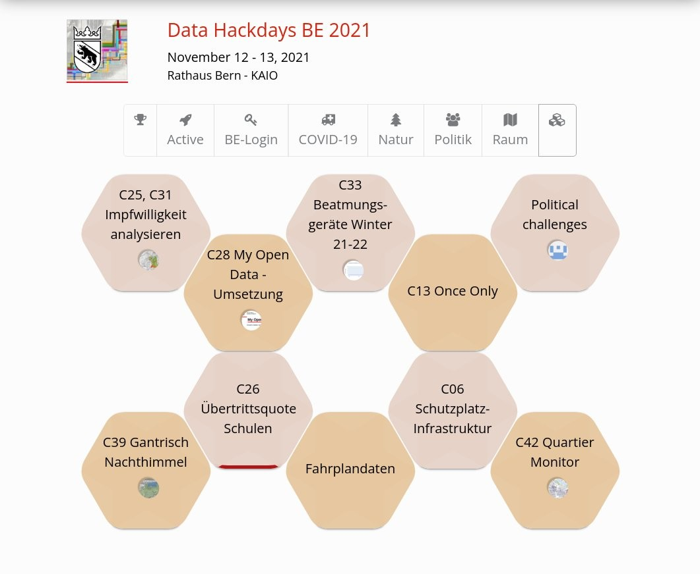
_Opendata.ch / [Data Hackdays BE 2021](https://hack.opendata.ch/event/45)_

Hackathons may be considered as a type of focus group, where platforms are evaluated, skills transferred, and horizontal insights accelerated by an open exchange of knowledge. This is an established venue to network, explore potential career paths while keenly evaluating prospective candidates or partners. Enabling better time management and coordination, such teamwork supported by dribdat should help to build a community of practice - lowering the barriers to entry for contributing creatively to NGOs, research, government, tech platforms and startups.

Datathons and hackdays go beyond a trendy way to find a job: they are venues for energetic collaboration which channel public engagement and technical experimentation within an open, socialised setting. In contributing to such events, the participants engage to respond to urgent questions, take opportunities to be active for diverse causes in pragmatic ways. It is important that the digital spaces they fill reflect these purposes in their construction and philosophy.

With the experience of deploying wikis, cloud-editors, and other awesome tools, we are using dribdat to streamline efforts of sharing knowledge across civic tech communities. Compared to competitive online platforms, dribdat puts more emphasis on cooperation and impact-making than competition. Users can join and contribute to multiple projects, where every row of data, line of code, or design sketch, is an integral part of your overall contribution to the community.

The name of dribdat is inspired by *dribbling* in basketball and other sports, with a hat tip to [Dribbble](https://dribbble.com/), an online community for graphic design, and the [Dat protocol](https://datproject.org/) for peer-to-peer data sharing. In this paper, you can learn about how we see the dribdat project as an open platform, a gateway to other collaboration tools, and a learning instrument for digital co-creation. In the following sections we dive deeper into what exactly makes dribdat tick.

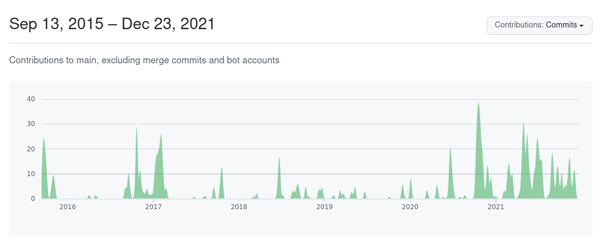

_Graph of contributions to the dribdat code base, via GitHub_

---

 # ➁ for corecreation

Designed to help participants and organisers to have a great time and focus on the essentials, dribdat features timekeeping and progress tracking dashboards to make it easier to form teams and sustain the energy in the room or online event. We aim to keep the focus on driving creative ideas forward while having fun: a kind of collaborative, multidisciplinary, sportive prototyping that we call **corecreation**.

The open source code of dribdat is accessible for free (under the MIT license), with instructions for self-hosting the platform anywhere that Python runs - which is, basically, anywhere. We are making it easier to deploy on popular platforms using package management and containers. With a running application, you can set up your first hackathon. Future events can run on the same site.

On the front page you can see the featured upcoming event, as well as any future and past events. A short description is followed by a link to the event home page, as well as a second-by-second countdown of time remaining until the start or the finish line (once started). *Projects*, *Challenges* and *Resources* are shown in the event screen. Here you can learn about topics, find datasets, get schedules or directions, and any other vital information that the organisers have provided.

Before the event begins it is possible to *Share a Challenge*, which can be organised by *Category*. People who are interested in it can approach the initiator in person, via contact channels, or just *Follow* the challenge. Once the event has started, you can form a team by clicking the *Join* button, taking over a challenge and boosting it, or selecting *Start project* to begin afresh when open challenges are permitted. The dribdat dashboard helps to keep track of remaining time for your all your registered teams.

The Challenges, and Projects that result from them, feature a large embedded frame at the top which can be connected to any Web-based tool. These are typically used to place a form for collecting data, a prototyping tool for iterating on designs, a data science notebook, or slide presentation. You can find visuals of all the elements above in the [User handbook](https://github.com/dribdat/dribdat/blob/main/docs/USAGE.md).

Only one tool can be in focus at a time, keeping participants on board as their projects pass through stages. When setting up an event, it is possible to recommend and preset a range of tools, making it easy to guide all your teams through a process of collecting ideas, refining designs, etc. This is something that we have found particularly helpful in a classroom setting. We hope that dribdat can also boost your sessions, by making the most of co-creation with the right toolbox. Join our community to share tips and workflows.

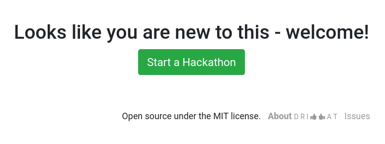

---

# ③ an open platform

Web technologies and open data standards are at the core of dribdat. Typically, hackathons need some kind of publishing workflow that collects data from the team in a series of forms. We have often encountered this to be a laborious process that steals valuable time from teams and organisers while introducing bias and latency. Project aggregation is facilitated by the ability to start a project on the basis of data from a coding platform, a chat channel, or an open web resource.

In practice, the teams using dribdat are free to work as they please: keeping up with every twist and turn in the online collaboration landscape, we try to nurture supportive communities sharing the best brainstorming, prototyping and code sharing tools, helping to ensure we can plug in and generate data from any preferred platforms.

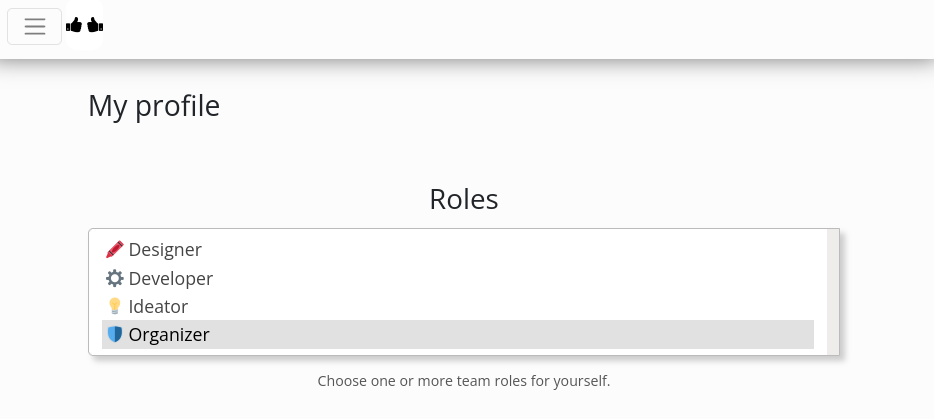
_Role selection in the profile editor_

Ideators who would like to get help with their challenge-writing or research can easily connect this with dribdat. Just embed your favorite cloud wiki or document editor and set open permissions. For example, [CodiMD](https://github.com/hackmdio/codimd) or [HackMD](https://hackmd.io) can be used to embed a collaborative document with commenting functionality, that can easily be turned into a pitch deck.

Designers can use their favorite prototyping tools, either uploading screenshots or sketches into the Pitch area, or - if they are web-accessible - embedding the tool directly into the top area of the project. For example, we have seen successful co-creation happen around an embedded [Excalidraw](https://excalidraw.com/) canvas or [Miro](https://miro.com/app/) board.

No 'copypasta' needed here, Developers! Code projects created in a compatible repository - such as [GitHub](http://github.com/), [GitLab](http://gitlab.com/), [Bitbucket](http://bitbucket.com/) - or documentation in supported wikis, such as [Etherpad](http://etherpad.org/), [DokuWiki](https://www.dokuwiki.org/), [Google Docs](https://www.google.com/docs/about/) - can be synchronised so that documentation can take place, and *continue to happen in a distributed way*, using standard formats, such as the *README* files preferred in open source.

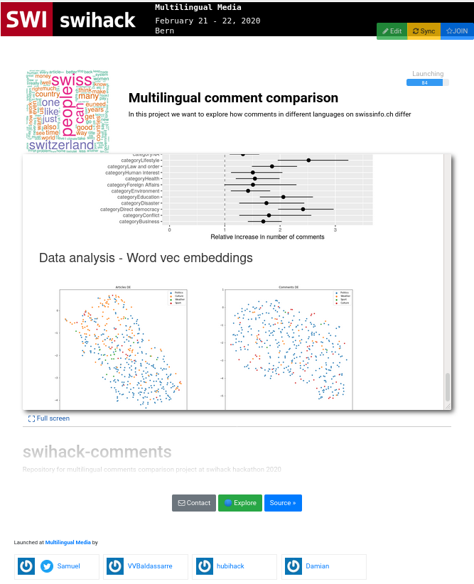
_Swiss Broadcasting Corporation / [#swihack 2020](https://swihack.ch/)_

Documentation that cannot readily be synced, such as data science notebooks as pictured above, is typically embedded using the _Project link_. This set-up both teaches your participants about key concepts of how publishing and integration on the Internet works today, and promotes a Web of Data approach to the collaboration setting.

The less friction there is between one tool and the next, the more effectively and flexibly our teams can iterate their designs. With dribdat we can visualize and put into practice the data streams connecting our platforms. Where there are hitches and barriers along the way, the open community around dribdat is well positioned to investigate and suggest improvements.

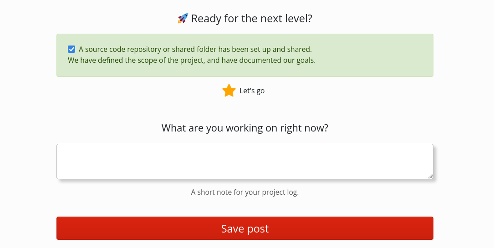

Any team member may write short, social media-like _Posts_ to document their work, while the API allows the use of other ways to capture insight into participant activity. This includes [dridbot](https://github.com/dribdat/dridbot#dridbot), a chat-mode integration compatible with Slack, RocketChat and other messengers, that allows updating projects directly within a team channel. Dribs are also automatically generated out of commit logs from supported code repositories.

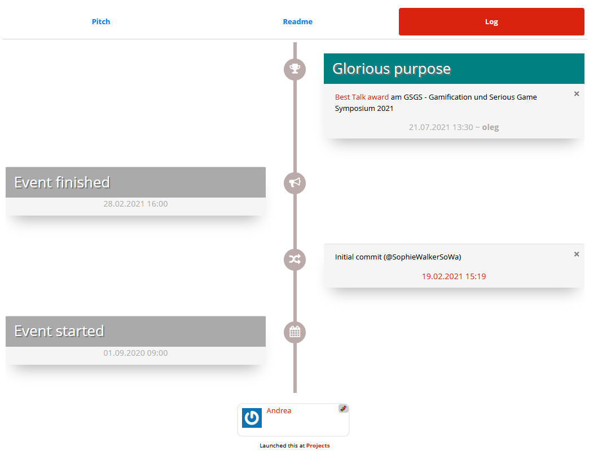

Your team's posts, or "dribs", that are visible in the _Log_ section of their project, are also aggregated with those of all the other teams in the  _Dribs_ section of the navigation. Event operators can recognize projects in a similar way. There is also a _Dashboard_, which organizers can set up alongside announcements, and an optional social media stream. This is typically used in digital signage.

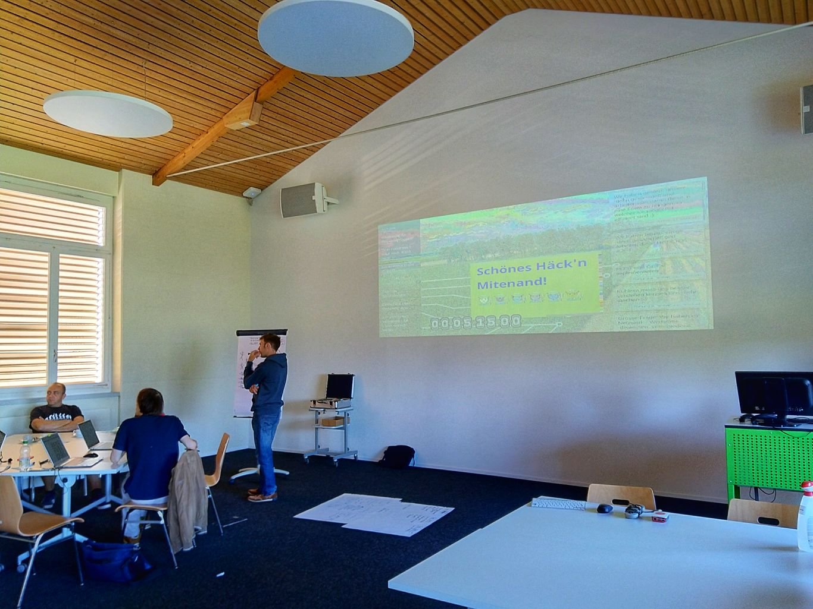
_Opendata.ch / [Open Farming Hackdays 2021](https://hack.farming.opendata.ch/event/1)_

---

# ④ reducing friction

Project presentations and demos made easily and efficiently available for evaluation when each team can update their own progress level, generating an automatic metric for profile completeness and activity levels, and giving each project a meaningful progress score.

Participants can subscribe to a challenge or join a project once someone has started it, and immediately gain access to improving the content. This is done using a simple form, and a [Markdown](https://daringfireball.net/projects/markdown/syntax) editor that helps to format your _Pitch_.

As they do this, their project gets linked in a public profile, where their personal contributions - dribs, reports, code commits, etc. - can be seen. By engaging regularly in this way, they can help their team climb through the normalizing progress stages of the event.

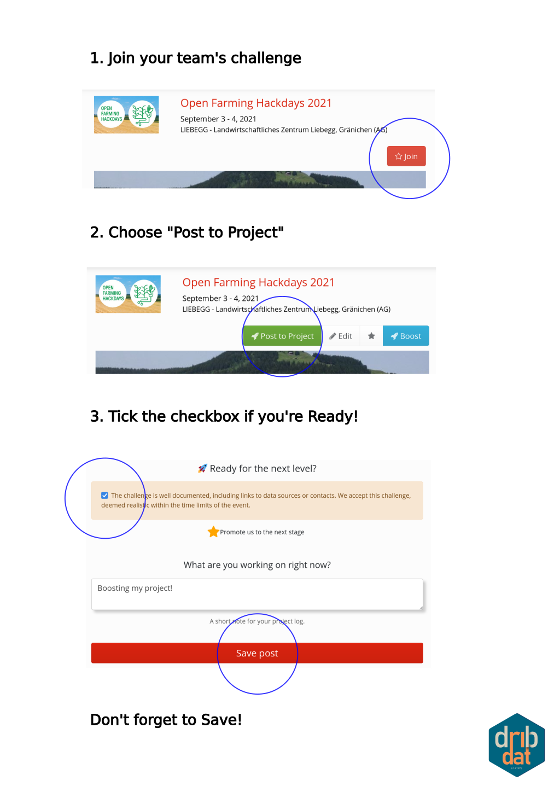

We are working to build dribdat into a powerful tool for tracking performance and recognising contribution -- for example, by supporting real-time collaboration in [CodiMD](https://github.com/hackmdio/codimd) and [Jupyter](https://jupyter.org/) notebooks embedded directly in the project, to minimise the friction of on-boarding contributors.

The data exports, APIs, and dashboards of dribdat allow organisers to at a glance see how all their teams rank both during and after the event. Fundamental to this is the experience of the hackathon participant, their ability to represent their team, to be aware of what's happening in the wider event, document their efforts, and present the results on time.

This kind of tooling has potential to be used in a variety of formats - from Agile Scrum sprints, to Design Thinking workshops and Rapid Prototyping: everywhere that time is of the essence, and a scrappy, "can-do" attitude reflective of the hacker ethic encourages better results, while enabling more venues for civic hacking and open data sharing.

We support several ways of extracting real-time statistics for insight on the pulse of the hackathon, pointing to improvements and providing motivational data-points as content. Check the admin dashboard for links and documentation.

> 💡 "Different sites (and people) have different needs. No one syntax would make all happy." -- John Gruber, co-creator of [Markdown](https://en.wikipedia.org/wiki/Markdown)

_Forum Helveticum / [Plurilingualism Hackathon 2018](https://hack.opendata.ch/event/22)_

---

# ⑤ assuring interoperability

Not just a metaphor: dribdat aims to be a digital glue between a plethora of tools and processes that are being deployed in the civic tech community, enabling quick and painless deployment - ideal for hackathons, but a need that is common throughout the IT and public sector. Tools like dribdat are important instruments in facilitating concentrated social change-making that is digitally sustainable.

Baked into the core of dribdat is support for Frictionless Data, the "open-source toolkit that brings simplicity and gracefulness to the data experience" ([frictionlessdata.io](https://frictionlessdata.io/)) which we use to accelerate the process of unpacking and exploring open information sources in the crucial early research & experimentation phases of a hackathon. When you create a Data Package of your dribdat event, it is a snapshot of all the projects and configurations which can be used for analysis, for backup, or even as a template for the next event with a one-click import. 

The foundation of this is an open schema that we are advocating for publishing hack-event results: `hackathon.json` - a simple, readable text file at the root of any dribdat instance. Along with Data Package support, our compliance for [Schema.org](https://schema.org/Hackathon) and [Open Graph](https://ogp.me/) standards helps to ensure that publications are picked up by search crawlers and easily federated.

For event organizers, the backend allows quick browsing and export of project data: in document form for evaluation by jury, or in `CSV` or `JSON` formats for external workflow. Spammy or invalid entries can be easily hidden or cleaned up. With `OAuth` support, user profile administration can go through an external, enterprise-scale provider such as GitHub or Slack.

We can generally support integration with any kind of data platform or collaboration tool through embedding or APIs. We can work with event management software, even other hackathon platforms, if you need to mix and match features: dribdat is intended to be part of an ecosystem of compatible Internet tools.

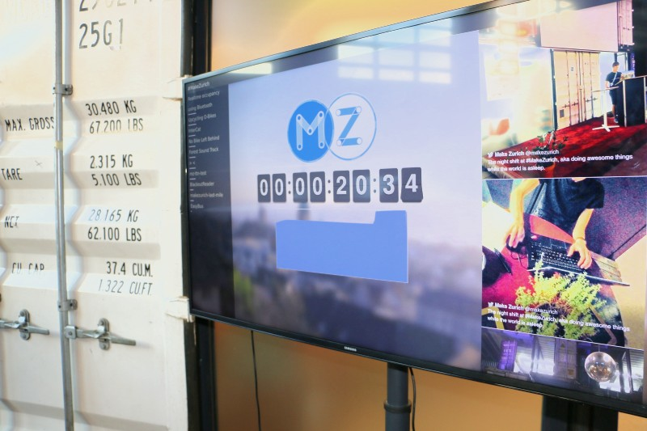
_Open Network Infrastructure Association / [MakeZurich](https://makezurich.ch/)_

---

# ⑥ being excellent to each other

The dribdat initiative is grounded in the tradition of creative and ethical hacking. We have combined best practices in using wikis, issue tracking, and content management systems, creating the basic framework of the application at a hackathon in 2015. Since then, we have battle-tested it at many events with thousands of people - and the people have spoken to us about what they want from the experience. Many of these demands concern the content and form of interaction between participants at the event, not so much the technical support.

As the ethics of code and algorithms, better public awareness and relationship to data protection are today a critical and urgent need - platforms like dribdat in the open development community are needed to explain and interact with frameworks of legal and moral agreement. For this reason, we are using dribdat to embed ethical codes, open access licensing, and even data sharing agreements into the activities of our community.

One of the most important areas of feedback has been to understand what information should be made as visible as possible, to benefit our users despite the time pressure. There is a clear and readable Code of Conduct, Terms of Participation, and Contributor Guidelines, available out of the box and customizable. By default, we support the [Hack Code of Conduct](https://hackcodeofconduct.org/) and [Creative Commons](http://creativecommons.org/) licenses.

_The standard footer deployed with a dribdat instance._

Independently developed at the grassroots, behind the scenes of this project are compacted qualities of what we believe entails good collaboration: a supportive atmosphere that proliferates diversity and tolerance, clearly stated goals, community support and progressive guidelines. Inclusive co-creation, designed to support processes that engender team-building diversity, is an area of active development, currently the focus of collaborations, research, and development.

As core methodology to help orient the teams, we have built in a customizable 7-step process inspired by the [School of Data Pipeline](https://schoolofdata.org/methodology/), that we recommend for attractive and efficient data expeditions and hackathons. Around each of these _Stages_, it is possible to set up Resources: recommended tools, datasets, brainstorming instruments, etc. Progressing from one step to the next is allowed based on simple programmable rules configured in `YAML`. This content can be customized by site owners to fit other patterns and practices.

_Screenshot of the [Stages screen](https://meta.dribdat.cc/event/1/stages)_

> 💡 "Maximize the following qualities in the projects at your event:
- **Clearly articulated.** Projects should have a clear question or problem they are trying to solve plus a reasonably specific proposed solution.
- **Attainable.** Most projects will accomplish about 25% of what they think they can accomplish in the limited time they have. Manage each project’s goals so participants are able to feel accomplished at the end of the session, not interrupted.
- **Easy to onboard newcomers.** Projects should have ready-to-go tasks for newcomers with a variety of skills and at a variety of skill levels. For coding projects, these tasks can’t require an intimate understanding of the code base, and make sure the build environment can be spun up in less than 20 minutes. Make a list of tasks or create github issues ahead of time!
- **Led by a stakeholder** (or “subject matter expert”) [who] guides a project to real-world relevance. Projects without a stakeholder can “solve” a problem that doesn’t exist. ... Beware when the leader is a stakeholder but can’t foresee how he or she might be implementing along with the rest of the team.
- **Organized.** For projects with four or more members, especially newcomers, the project leader’s role should be to coordinate, ensuring each team member has something to work on and helping to welcome new team members."

_Joshua Tauberer, [hackathon.guide](https://hackathon.guide)_

---

# ⑦ what's next in the pipeline

Our [Open Collective](https://opencollective.com/dribdat) offers a number of ways to support our project, from code and financial contribution to helping us to prioritize development and govern the overall initiative. Here are some areas where we think improvement should happen in the medium term. You will find these and a variety of enhancements being proposed and worked on in our [Issue Tracker](https://github.com/dribdat/dribdat/issues). That said, let's try to keep in mind that dribdat is a niche product with unique features and limited scope.

### User management

While dribdat has built-in user profiles, the application currently has minimal user management features. Collecting personally identifiable information is not the goal of the project - facilitating recognition in a privacy-protecting way is. We take personal data seriously, but try to keep a small footprint in the tradition of tightly focused software utilities.

Instead of maintaining e-mail validation, user management and password reset functions, we suggest using OAuth for authenticating users of dribdat through a trusted identity service like Slack, GitHub, or any OAuth 2-compatible provider. Once configured, the user is shown a dialog like this to log in, in the case of Slack: 

We furthermore encourage users to create profiles in a community platform that you integrate with dribdat - such as the open source [Discourse](https://www.discourse.org/) forum software, or at least to connect their social media profiles. You could also recommend "CV builder" platforms (e.g. [Stack Overflow](https://stackoverflow.blog/2016/10/11/bye-bye-bullets-the-stack-overflow-developer-story-is-the-new-technical-resume/)) to conveniently promote everyone's hackathon experiences. The ability to display participant accomplishments in an interesting way remains an area of improvement.

That said, we allow admins to create accounts, which opens the door to giving credit to proxy users - these people who, for example, participated at a physical event but did not create a user account. Permission to use of an anonymous username and disposable e-mail address to log in to dribdat further widen the appeal in less formal contexts and communities.

### Questionnaires

Currently dribdat does not include a form builder, though you are welcome to fork and make changes to the data schema in Python code. We have left the project structure open ended, allowing operators and teams to define how people can engage as contributors or testers. This is certainly part of the challenge of succeeding with promoting a hackathon idea, but also a major area of improvement to assist beginners and encourage active participation through questionnaires and templates.

While it is possible to include this in the "Getting Started" guide shown to teams, we see many organisers set up separate online forms for registration, collecting feedback, or asking specific questions to the teams. At some hackathons, like the [hacknight challenge](https://hacknight.dinacon.ch/project/10) pictured here, we follow an easy-moderate-advanced structure ("ski pistes") in their task descriptions, reflecting the _Easy to onboard newcomers_ aspect in Joshua Tauberer's points in the previous section. Yet other events have set up a Challenge template, which requires idea submitters to think about it step-by-step.

### Mobile app

While featuring a robust and mobile-ready user interface, the overall User Experience is basic and familiar to many of our users who are users of Twitter, GitHub and similar online apps. Our project has made small but significant UX engineering efforts, while catering perhaps more to the needs of grassroots communities who prefer a simple, "no-frills" interface. If you desire an application is more in the foreground and engaged with by users, check out the [backboard](https://github.com/dribdat/backboard) project which we started in response to requests for a smoother mobile UI for participants. It is a [Vue.js](https://vuejs.org/) project based on a client/server [architecture](https://github.com/dribdat/design/blob/master/Technical%20guide%20final.pdf), and as a custom app, allows completely flexible customization and branding.

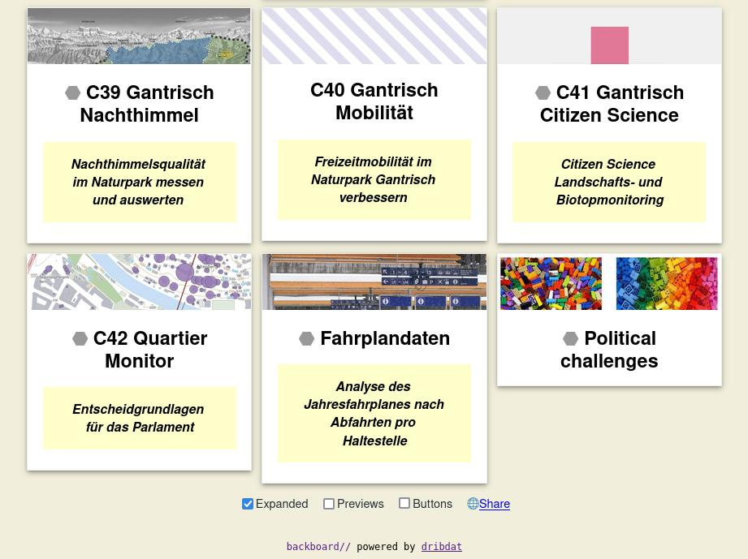
_Screenshot of a [backboard deployment](https://backboard.vercel.app)_

### Integrations

In running hackathons, we are used to relying on a bunch of complementary tools. The organizing teams often use cloud tools, spreadsheets and calendars to make drafts and detailed plans. Clearly, the goal should not be to replace all of this with a new "[15th competing standard](https://xkcd.com/927/)". Integration with Web tools like wikis and docs is already at the core, with the goal of making it easy to put dribdat into your workflow. For example, we have run events where all the content is maintained in Google Docs and Google Calendar, and then just synced into dribdat. Other sites are successful in leveraging Airtable, GitHub and Microsoft Teams for content and user experience integration.

### Support channels

The code base of dribdat has developed organically using crowdsourced requirements. At time of writing, there is no broadly available Platform as a Service or a service provider running instances on demand. We believe there is a need for this and are taking steps in this direction. We are also involved in wider attempts to build scalable "operating systems" for hackathons.

While setting up a small dribdat instance is easy and should be enough for a few teams to get started, the organizers of large events typically rely on more advanced support. Vendors who want to fully support dribdat should have experience with Python, OAuth and Web APIs, and be able to provide advice on how best to plug dribdat into your collaboration infrastructure. Notes on the architecture and supporting dribdat can be found in the [documentation](https://github.com/dribdat/dribdat/tree/main/docs).

If you have questions, just ping us through the project contacts. Visit the dribdat [Design repository](https://github.com/dribdat/design) for more articles and wireframes of our designs. This is also where the Whitepaper you are reading now lives!

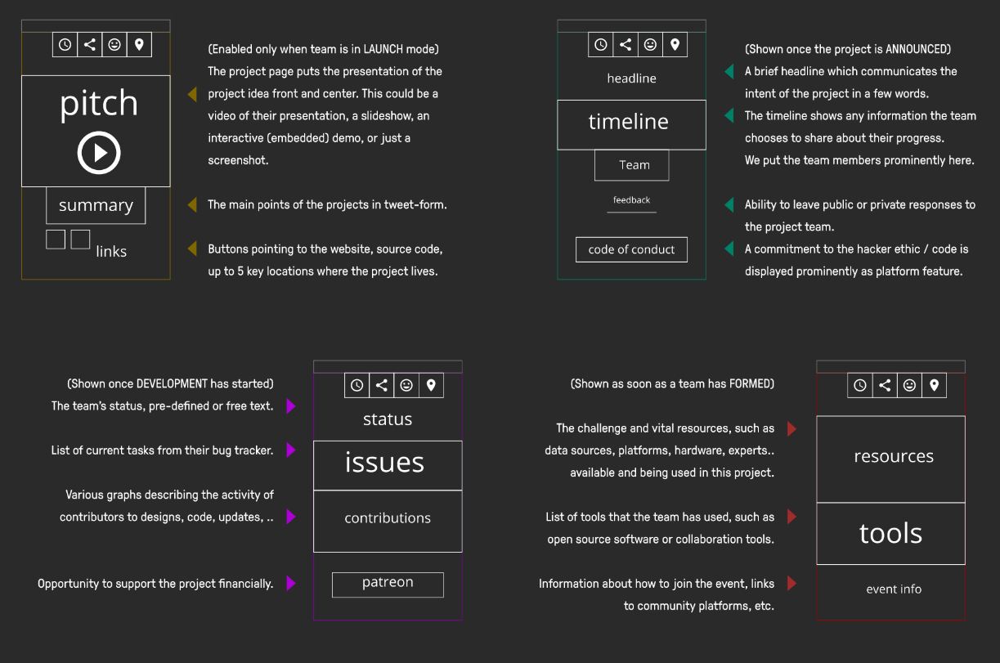

---

# ⑧ the open alternative

In this section, we draw comparison to several other open source platforms and applications for hackathon-type events, which have most strongly inspired our work. While project management tools, online forums, digital whiteboards, and conceivably any reasonably flexible collaboration platform can be used to run ideation events, specialized products can help to quickly build a team, evaluate progress, and "get in the groove".

Platforms that are accessible to the general public (no matter how technically astute or not), and produce useful documentation, are popular with [civic tech](https://github.com/dribdat/dribdat/issues/240) and digital society initiatives. In the arena of student events, things are more focused on admissions, competition, and jury evaluation. Despite the differences across the spectra of audiences, we hope to see some of the core functional aspects modularized, enabling more code and design sharing to improve hackathon experiences everywhere.

[HackDash](https://github.com/impronunciable/hackdash) (pictured above) by Dan Zajdband and team for [Hacks/Hackers](https://www.hackshackers.com/) events, is an open source hackathon platform written in Node.js and uses MongoDB. It has a popular public site [hackdash.org](https://hackdash.org/) where anyone can create a dashboard with a few clicks. At time of writing, over 2'000 of them have been created, collecting at least 7'000 ideas and 900 released projects. We could learn a lot from their dedicated community and interesting [concept statements](https://github.com/impronunciable/hackdash/wiki/Ideas-&-Improves).

[JunctionApp](https://github.com/hackjunction/JunctionApp) by a Finland-based non-profit, is an "All-in-one hackathon platform for organisers" catering to international business users. It is open source and also written in Node.js with Express, Mongoose and React. It is highly scalable, has a slick user experience, and has been translated to Chinese. The management of event content is highly flexible, but the project data is rather barebones, and there are no user profiles at time of writing.

[Quill](https://github.com/techx/quill) from the TechX program at MIT, is the most active and followed open source hackathon platform on GitHub, focusing on the registration process. Written in Node.js, Express, Mongoose and Angular, it is technically similar to dribdat and the apps mentioned above, but more refined when it comes to the process of onboarding new participants, which have 10 possible statuses as they apply, get selected, and finally officially join the event. Being really focused on this aspect of the hackathon, it tries to get the job done and leave the rest to other tools. We can learn from its compliance to Accessibility measures, excellent user management (a.k.a. "God mode") and statistics.

[Versus Virus](https://github.com/VersusVirus-Hackathons/VersusVirus-App) was a series of events in 2020 in response to the COVID-19 pandemic, for which a small group (including Oleg from the dribdat project, Swiss software engineers from Panter AG and The Port Association at CERN), rapidly designed and implemented a highly scalable client-server web application for the onboarding process of the large hackathons of the same name. Based on Node.js, Next.js and PostgreSQL, it relies heavily on GraphQL interfaces. It is in many ways a next-generation version of dribdat, and its design focuses on the team-building process which is powered by a unique matching algorithm. The project is at time of writing unfortunately inactive and unsupported, but is the subject of continued study and inspiration.

Visit [awesome-hackathons](https://github.com/dribdat/awesome-hackathon) for links to other projects that you may wish to evaluate and compare with dribdat, complementary tools and further resources.

_Opendata.ch / [Energy Data Hackdays 2020](https://hack.opendata.ch/project/463)_

----

# ⑨ always be closing

The development of dribdat has involved coding by a diverse group, standardization efforts, enterprise software integration, and academic research. Alternative versions and new designs are being promoted through fully open platforms, and it is possible to follow and support the work through an [OpenCollective](https://opencollective.com/dribdat/).

Until today, dribdat has been built on the shoulders of the same giants who have helped to make our hackathons teams productive: code repositories like GitLab and GitHub, backend libraries like Flask and SQLalchemy, the Bootstrap UI framework, and more. We recognize, and strive to give back to these open source projects.

As a web application, dribdat can run as a cloud service, as an on-premises self-hosted solution, or even on a dedicated hardware device for ease of deployment. We are committed to stay close to our roots: dribdat itself will always be open, hacky, experimental, and accessible to tinkering. A project like this is never "finished", and we are always on the look-out for fresh ideas that turn our world view upside-down.

In the first years of service, dribdat has supported dozens of events around Switzerland, becoming the official hackathon platform of [Opendata.ch](https://opendata.ch) - Swiss chapter of Open Knowledge and its working groups, the [Open Network Infrastructure Association](https://opennetworkinfrastructure.org/), [DINAcon](https://dinacon.ch) - the largest annual Swiss conference for digital sustainability, [DayOne](https://dayone.swiss) - an association that runs patient-centric hackathons, and other pioneers listed in the Showcase futher on. Over 3'000 user accounts and at least 700 projects have been published with dribdat during this time.

The easiest way to try dribdat is to sign up for an upcoming event with such an organization, and to use our platforms as participant. You can visit the home page to get links to example deployments, instructions on how to set up your own server and start your own events. If you need help or advice with any of this, or would like to contribute to the project in some way, please get in touch using the links below.

### In a nutshell, dribdat...

-   ... has had [1'359 commits](https://www.openhub.net/p/dribdat/commits/summary) made by [9 contributors](https://www.openhub.net/p/dribdat/contributors/summary) representing [11'604 lines of code](https://www.openhub.net/p/dribdat/analyses/latest/languages_summary)
-   ... is [mostly written in Python](https://www.openhub.net/p/dribdat/analyses/latest/languages_summary) with [a low number of source code comments](https://www.openhub.net/p/dribdat/factoids#FactoidCommentsLow)
-   ... has [a well established, mature codebase](https://www.openhub.net/p/dribdat/factoids#FactoidAgeOld) maintained by [a small development team](https://www.openhub.net/p/dribdat/factoids#FactoidTeamSizeSmall) with [increasing Y-O-Y commits](https://www.openhub.net/p/dribdat/factoids#FactoidActivityIncreasing)
-   ... took an estimated [3](https://www.openhub.net/p/dribdat/estimated_cost) [years of effort](https://www.openhub.net/p/dribdat/estimated_cost) (COCOMO model) starting with its [first commit in September, 2015](https://www.openhub.net/p/dribdat/commits?sort=oldest)\
    ending with its [most recent commit](https://www.openhub.net/p/dribdat/commits).

*Generated at [openhub.net/p/dribdat](https://www.openhub.net/p/dribdat)*

---

# @ contacts

Your feedback is very welcome. Just open a discussion thread in one of the community channels:

- Homepage: [dribdat.cc](https://datalets.ch/dribdat)
- Operations: [opencollective.com/dribdat](https://opencollective.com/dribdat)

_News_

- Updates: [opencollective.com/dribdat/updates](https://opencollective.com/dribdat/updates/)
- Mastodon: [@dribdat](https://mastodon.social/web/@dribdat)
- Twitter: [@dribdat](https://twitter.com/dribdat)
- Discourse: [forum.opendata.ch](https://forum.opendata.ch/search?q=dribdat%20order%3Alatest)

_Development_

- Sources: [github.com/dribdat](https://github.com/dribdat/dribdat) or [gitlab.com/dribdat](https://gitlab.com/dribdat/dribdat)
- Releases: [dribdat/releases](https://github.com/dribdat/dribdat/releases)
- Bug tracker: [dribdat/issues](https://github.com/dribdat/dribdat/issues)

~ _**All our hack are belong to us.**_ ~

---

# @ references

You can find our inspirations and additional references at [dribdat/awesome-hackathon](https://github.com/dribdat/awesome-hackathon). On the following pages are reference deployments with some background information from **2015 - 2021**

---

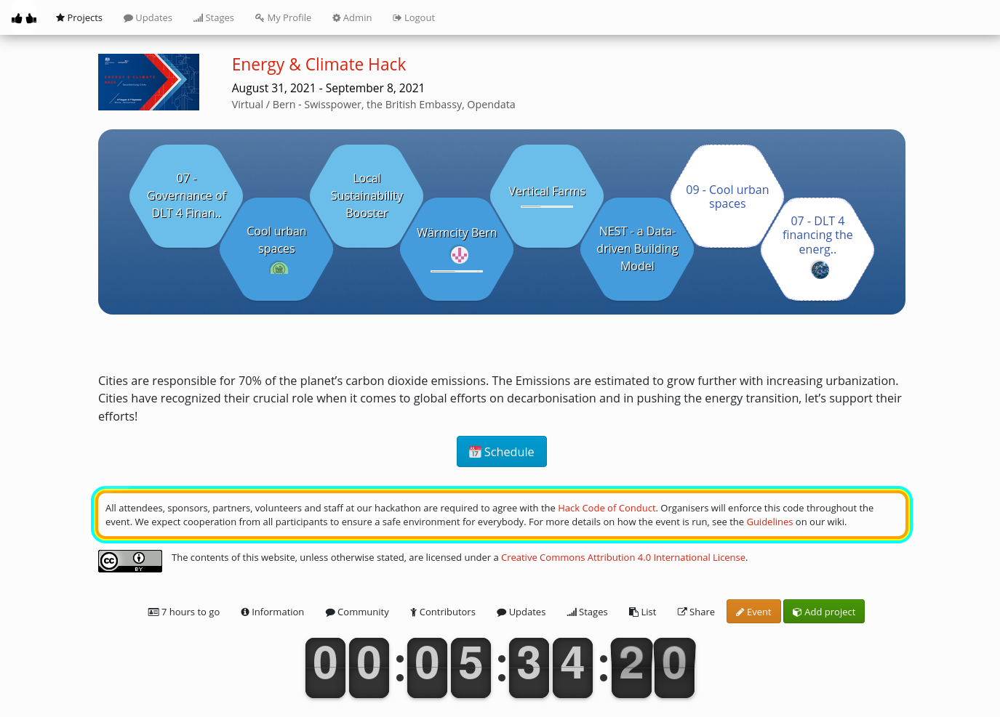  

### Energy & Climate Hack

**User:** Swisspower, Opendata.ch

**Application:** https://hack.opendata.ch/event/36

**Discussion:** https://forum.opendata.ch/t/31-8-1-9-energy-climate-hack/783

**Integrations:** Slack, Google Drive, GitHub

---

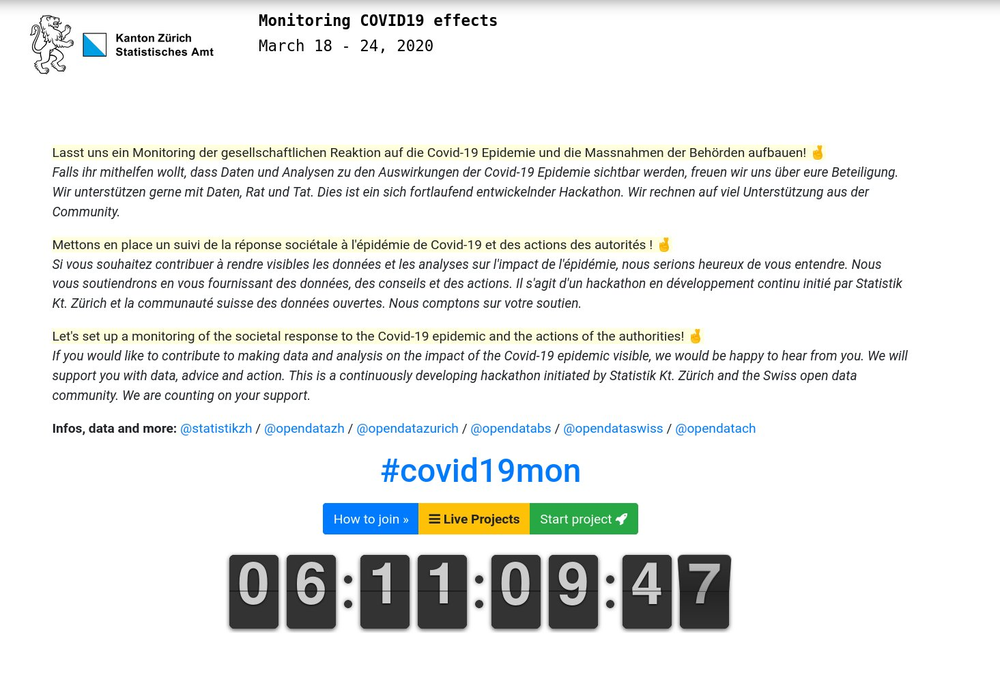

*The open data community at the front-lines of a digital response to the COVID-19 pandemic.*

### #covid19mon

**User**: Canton of Zürich

**Application:** <https://db.schoolofdata.ch/event/7>

**Discussion:** <https://forum.opendata.ch/t/18-3-1-year-of-covid19mon/757>

**Integrations:** Mattermost, GitHub

---

[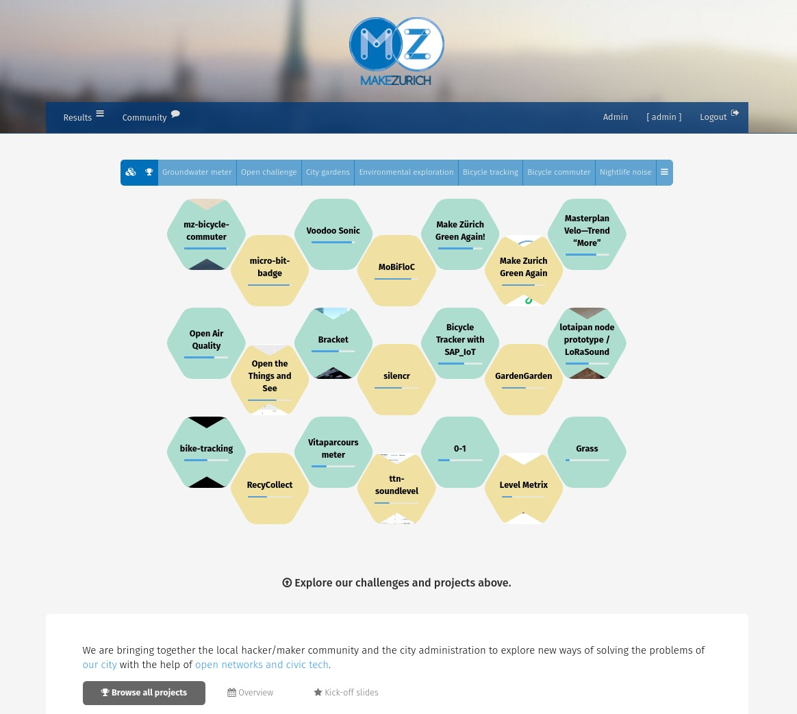](http://now.makezurich.ch/)

*An interest to accelerate hackathons using the Internet of Things is at the heart of dribdat.*

### MakeZurich

**User**: Open Network Infrastructure Association

**Application:** http://now.makezurich.ch/

**Discussion:** https://forum.schoolofdata.ch/t/22-30-6-makezurich-2018

**Integrations:** Slack, GitHub, The Things Network

---

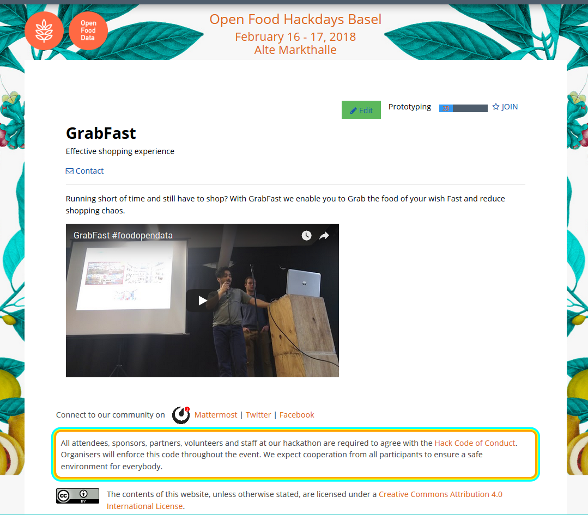

*Since 2016, dribdat is the official platform of Opendata.ch Hackdays.*

### Open Data Hackdays

**User:** Opendata.ch - Swiss Chapter of Open Knowledge

**Application:** [http://hack.opendata.ch/](http://hack.opendata.ch/event/18)

**Discussion:** https://blog.datalets.ch/039/

**Integrations:** Datacentral, CKAN, Discourse, GitHub, Slack

---

### Evaluation Hackathon

**User:** International Program for Development Evaluation Training

**Application:** https://evalhack.org/

**Discussion:** https://opencollective.com/dribdat/updates/a-season-of-hackathons

**Integrations:** Slack, Disqus, YouTube

---

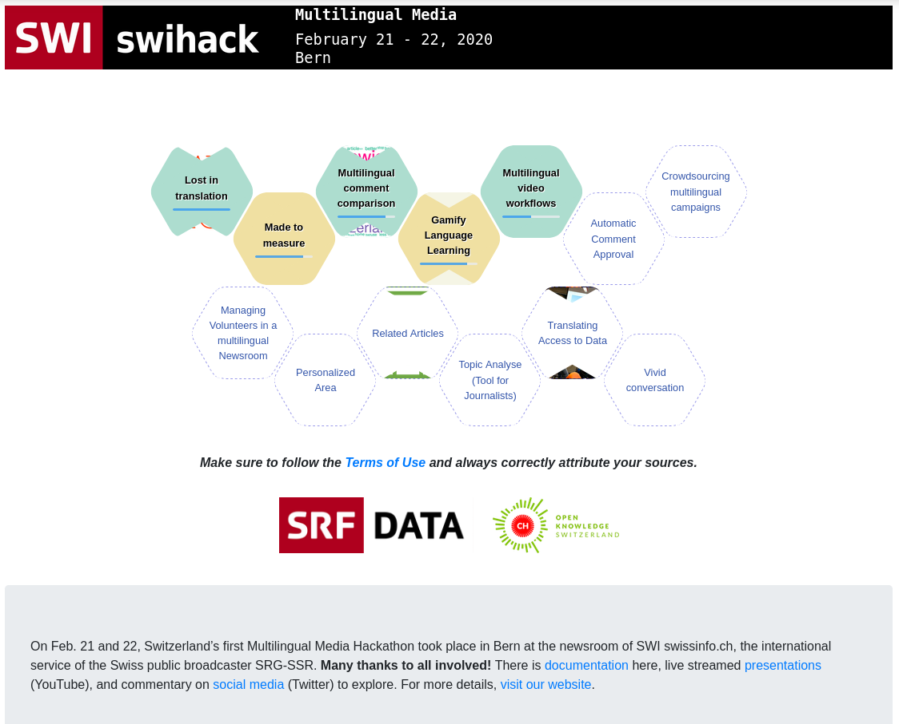

### Multilingual Media Hackathon

**User:** Swissinfo

**Application:** https://db.schoolofdata.ch/project/58

**Discussion:** https://blog.datalets.ch/065/

**Integrations:** CodiMD, GitHub, YouTube

---

[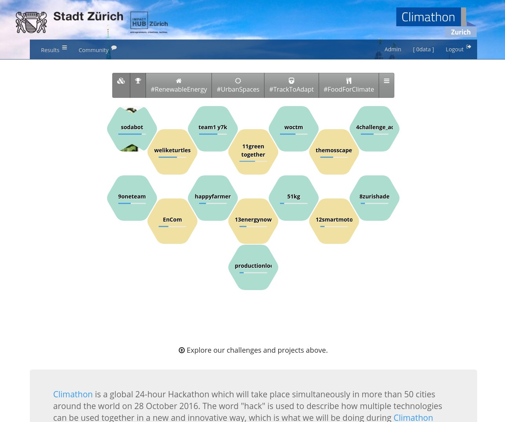](https://hack.opendata.ch/event/4)

### Climathon Zurich

**User:** City of Zürich

**Application:** http://hack.opendata.ch/event/4

**Discussion:** https://blog.datalets.ch/023/

**Integrations:** Slack, Hubot (sodabot), GitHub

---

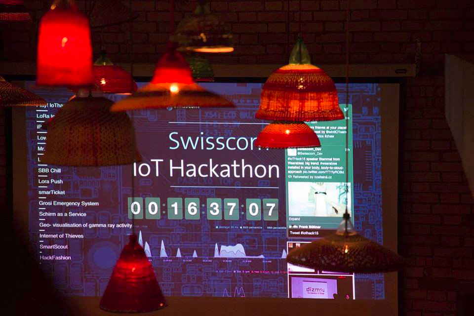

*The first release of dribdat was designed in cooperation with Swisscom. Image courtesy of [Impact Hub Zürich](https://zurich.impacthub.ch/de/cross-sector-innovation/).*

### Internet of Things Hackathon

**User:** IoT Zürich Community

**Application:** https://datalets.ch/dribdat/iot-2015/

**Discussion:** https://blog.datalets.ch/an-internet-of-open-things-to-tell-stories/

**Integrations:** Slack, GitHub, Twitter, Instagram, Heroku, custom hardware

---

EOF
