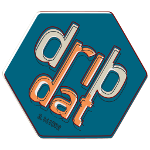

**Driven By Data**

---

1. [About dribdat](about)
1. [User handbook](usage)
1. [Installation guide](deploy)
1. [How to contribute](contribute)
1. [Whitepaper](whitepaper)
1. [Troubleshooting help](trouble)

---

**Dribdat** (from "driven by data") is an open source (MIT licensed) web application, featuring an ideation and challenge board to help organize short sprints, co-creative sessions, hackdays and open hackathons with batteries included.

🎉 We are starting a next-generation app - **EveryHack** - based on Dribdat and [Backboard](https://codeberg.org/dribdat/backboard). See [announcement](https://meta.dribdat.cc/project/161) and sign up to the alpha at [EveryHack.day](https://everyhack.day).

## Purpose

Built around Web-friendly standards like [Schema.org](https://schema.org) and [Frictionless Data](https://frictionlessdata.io), Dribdat features a collection of bootstraps (authentication, file uploading, data import/export, etc.), useful workflows (announce an event - publish challenges - form teams - develop projects) and channels (social media sharing, digital signage, summary reports).

Dribdat events typically involve open licenses ([Creative Commons](https://creativecommons.org/licenses/), [Open Data Commons](https://opendatacommons.org/licenses/odbl/), etc.), community-developed templates ([School of Data Pipeline](https://schoolofdata.org/methodology/)), and governance instruments ([Hack Code of Conduct](https://hackcodeofconduct.org/)).
This is the official platform of [Opendata.ch - Swiss chapter of Open Knowledge](https://opendata.ch), and has been used to host dozens of events in the Swiss [open data](https://hack.opendata.ch), [open hardware](https://now.makezurich.ch), and [open source](https://hacknight.dinacon.ch) community.

Dribdat strives in itself to be an example of a hackable project that can be adapted to other needs and causes.
It can be used just as a Python-powered backend to aggregate data from Gitea, GitHub, GitLab and other repositories and fileshares in one place.
There is a `Vue.js`-based [Backboard app](https://github.com/dribdat/backboard) and a `Node.js` [Chatbot](https://github.com/dribdat/dridbot) available as alternatives to the default Bootstrap user interface, easily customized with a bit of `CSS`.
You can customize the layout and presets in an admin panel, or with `YAML` configuration files.

There is more on this in the [User Guide](usage) and [Whitepaper](whitepaper).

 🌳 😄 🏀

## Contact

Please use our [discussion forum](https://github.com/orgs/dribdat/discussions) or [raise an issue](https://github.com/dribdat/dribdat/issues). If you would like to improve the documentation, share [feedback here](https://github.com/dribdat/docs/issues), or contribute via Pull Request on GitHub. You can also use our [Codeberg mirrors](https://codeberg.org/dribdat) to do this. Further contact options:

- Subscribe to get updates on our [OpenCollective](https://opencollective.com/dribdat/updates), where you can also support our development.
- Find a sampling of Dribdat-powered events at [Tour de Hack](https://meta.dribdat.cc/event/5) and [OpenCollective Events](https://opencollective.com/dribdat/events).
- Get in touch with [the maintainers](mailto:dribdat@datalets.ch) if you'd like to get help accelerating your community!
